---
## Author
author:
  name: Ниязов Санджар
  degrees: DSc
  orcid: 0000-0002-0877-7063
  email: suzbek006@gamil.com
  affiliation:
    - name: Российский университет дружбы народов
      country: Российская Федерация
      postal-code: 117198
      city: Москва
      address: ул. Миклухо-Маклая, д. 6

## Title
title: "Отчёта по лабораторной работе"
subtitle: "Установка и настройка операционной системы на виртуальную машину"
license: "CC BY"
---

# 1.Цель работы

---
title: "Отчёт по лабораторной работе №1"
subtitle: "Установка и настройка операционной системы на виртуальную машину"
author: "Ниязов Санжар"
institute: "Российский университет дружбы народов"
date: "2 марта 2026 г."
---

# 1. Цель работы

Целью данной работы является приобретение практических навыков установки операционной системы на виртуальную машину, настройки минимально необходимых для дальнейшей работы сервисов.

# 2. Выполнение работы

## 2.1. Скачивание VirtualBox и образа Fedora

Перед началом работы были скачаны необходимые файлы с официальных сайтов. С сайта [virtualbox.org](https://www.virtualbox.org) был загружен установщик VirtualBox для Windows версии 7.2.6, а также Extension Pack для обеспечения дополнительной функциональности (поддержка USB 2.0/3.0, общий буфер обмена). С сайта [fedoraproject.org](https://fedoraproject.org/spins/sway/) был загружен образ операционной системы Fedora Sway Live x86_64 версии 43.

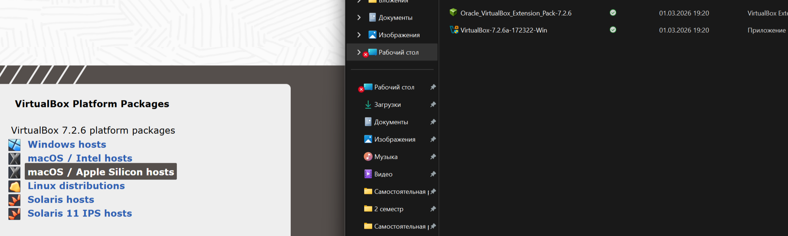
*Рисунок 1 – Страница загрузки VirtualBox с доступными пакетами*

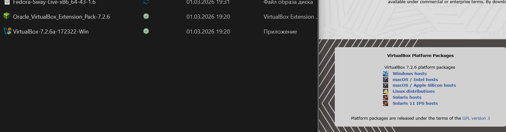
*Рисунок 2 – Файлы VirtualBox, Extension Pack и образа Fedora*

## 2.2. Настройка VirtualBox

После установки VirtualBox была выполнена его начальная настройка. В соответствии с требованиями лабораторной работы была изменена папка для хранения виртуальных машин по умолчанию на `D:\VirtualBox_Lab\`, а также настроена хост-комбинация для удобства работы.

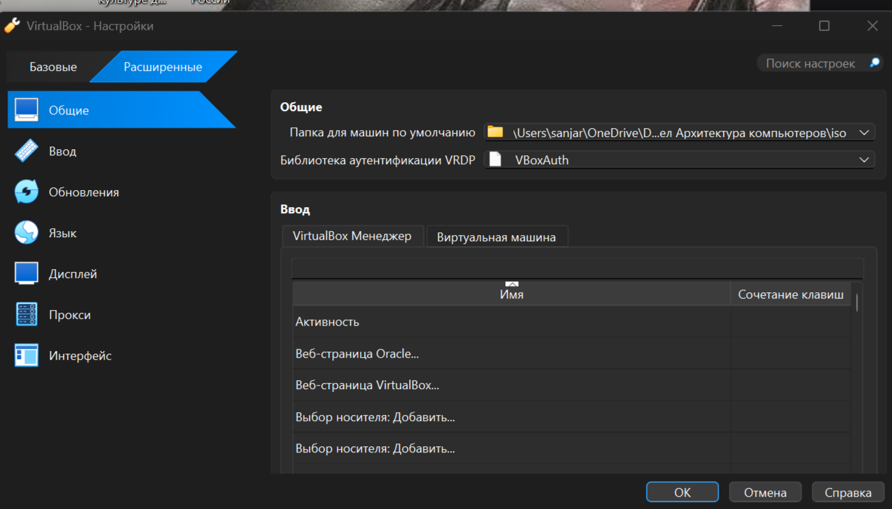
*Рисунок 3 – Окно настроек VirtualBox с указанием папки для машин*

## 2.3. Создание виртуальной машины

Была создана новая виртуальная машина с именем `sniyazov1`, соответствующем логину студента. Тип операционной системы указан как Linux, версия – Fedora (64-bit). На этом этапе образ ISO не подключался, чтобы избежать автоматической установки.

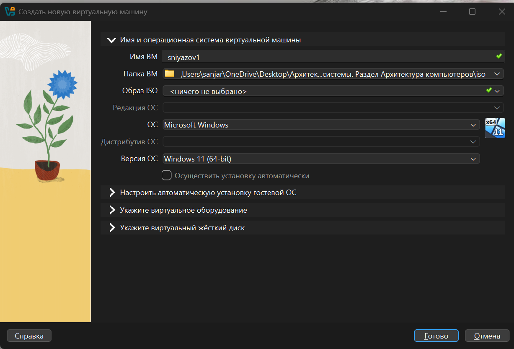
*Рисунок 4 – Создание новой виртуальной машины с именем sniyazov1*

## 2.4. Настройка параметров виртуальной машины

Для корректной работы гостевой ОС были настроены следующие параметры оборудования:
- **Оперативная память:** 2048 МБ (рекомендованный минимум для Fedora).
- **Процессор:** 2 ядра (для обеспечения достаточной производительности).
- **Включена поддержка EFI:** в соответствии с требованиями лабораторной работы.

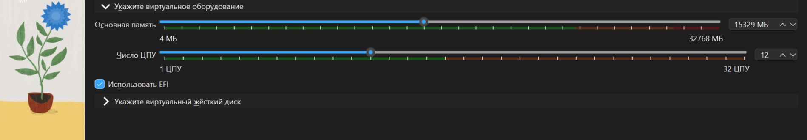
*Рисунок 5 – Настройка оперативной памяти, процессора и включение EFI*

## 2.5. Создание виртуального жесткого диска

Был создан новый виртуальный жесткий диск со следующими параметрами:
- **Тип:** VDI (VirtualBox Disk Image).
- **Формат:** динамический (занимает место на хосте по мере заполнения).
- **Размер:** 80 ГБ (как указано в задании).

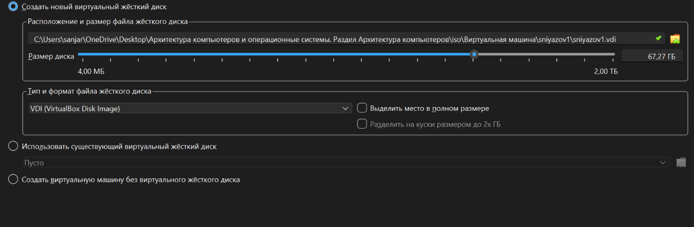
*Рисунок 6 – Создание виртуального диска размером 80 ГБ*

## 2.6. Настройка автоматической установки

В мастере создания ВМ была доступна опция автоматической установки. На этом этапе были оставлены временные данные (`vboxuser`), так как имя пользователя будет задано непосредственно в установщике Fedora.

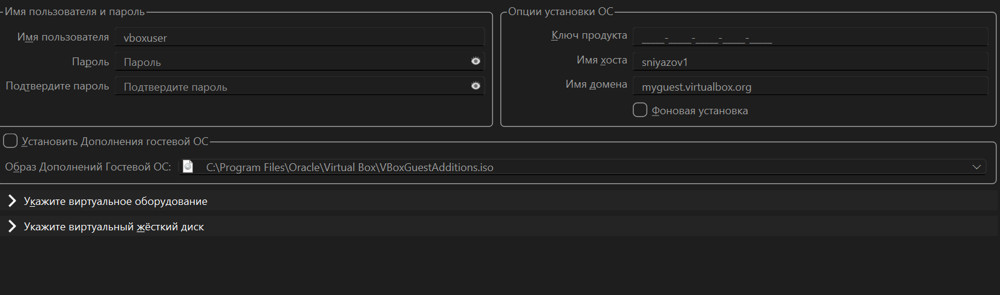
*Рисунок 7 – Окно настройки автоматической установки гостевой ОС*

## 2.7. Загрузка LiveCD

После завершения создания машины в настройках был подключен скачанный ISO-образ Fedora, и машина была запущена. Процесс загрузки LiveCD сопровождался выводом диагностических сообщений, включая предупреждения графического драйвера (`umuxfx`), что является известной особенностью работы Sway в VirtualBox.

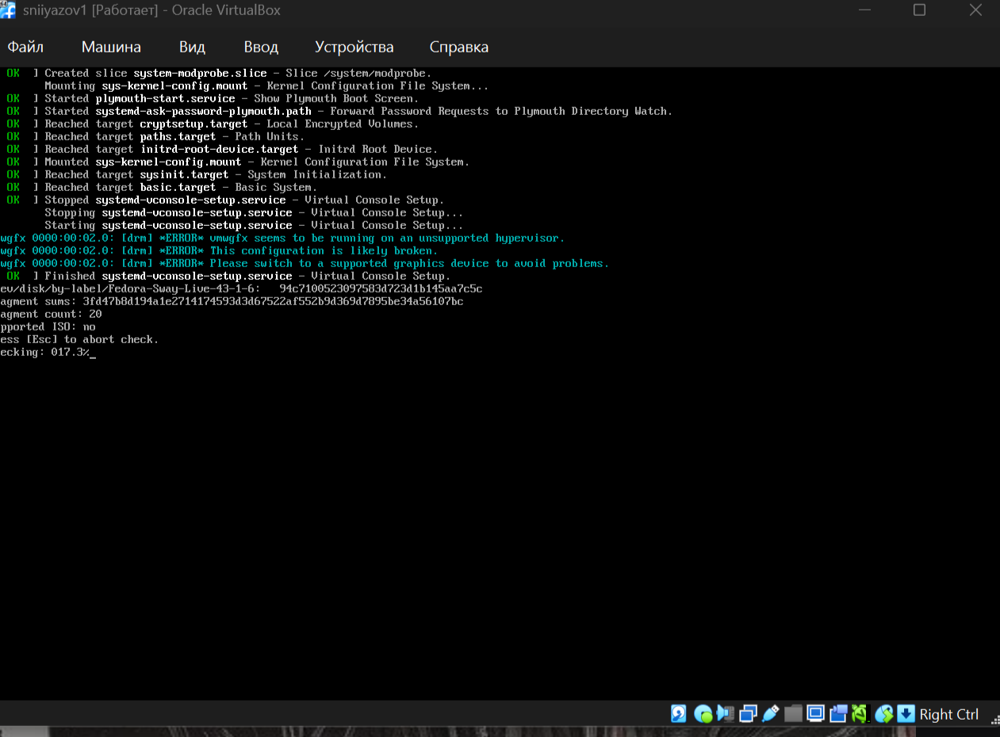
*Рисунок 8 – Загрузка LiveCD с диагностическими сообщениями*

В загрузочном меню был выбран пункт `Start Fedora-Sway-Live 43` для запуска Live-режима.

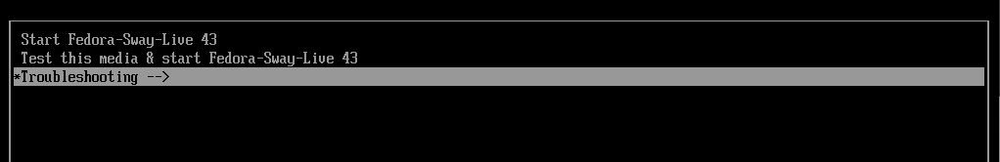
*Рисунок 9 – Меню выбора режима загрузки LiveCD*

## 2.8. Запуск установщика

После загрузки графического окружения Sway была нажата комбинация `Win+D` для открытия меню приложений, а затем `Win+Enter` для запуска терминала, как указано в инструкции на рабочем столе. В терминале была выполнена команда `liveinst` для запуска графического установщика Anaconda.

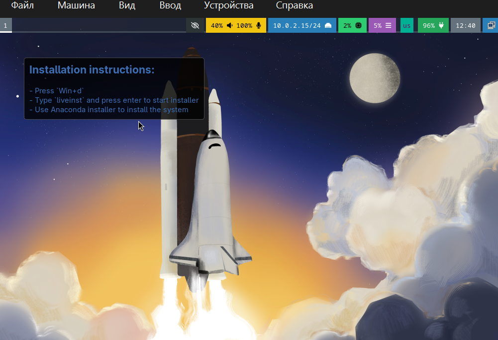
*Рисунок 10 – Инструкция для запуска установщика*

## 2.9. Установка системы через Anaconda

Установка Fedora была выполнена с помощью программы Anaconda. Ключевые этапы установки:
1.  Выбор языка интерфейса (русский).
2.  **Настройка диска:** выбран пункт «Использовать весь диск», так как виртуальный диск чистый.
3.  **Настройка пользователя:** создан пользователь `sniyazov01`, которому были предоставлены права администратора (группа `wheel`). Пароль для `root` не задавался, вход через `sudo`.
4.  Запуск процесса установки.

После завершения копирования файлов система предложила перезагрузиться.


*Рисунок 11 – Выбор диска и типа установки*

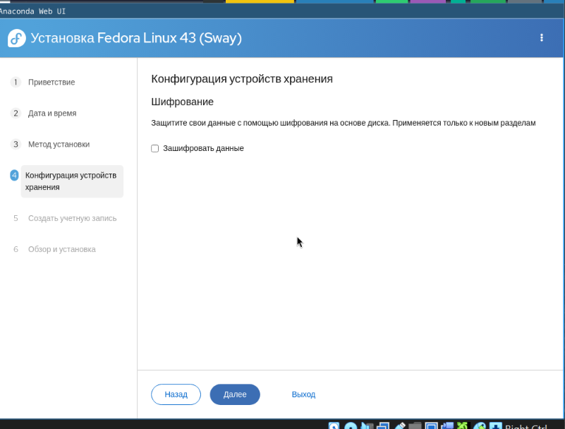
*Рисунок 12 – Настройка хранилища (шифрование не использовалось)*


*Рисунок 13 – Создание пользователя sniyazov01 с правами администратора*

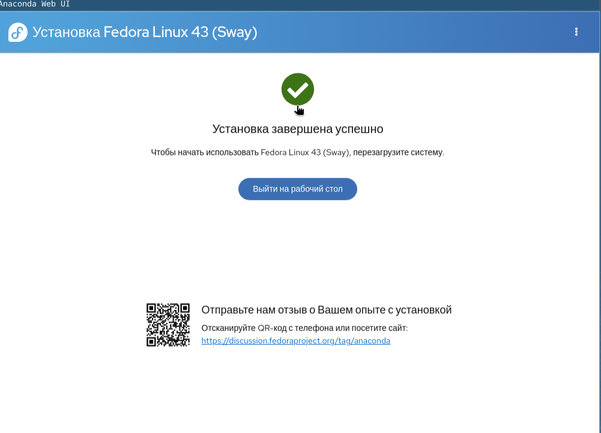
*Рисунок 14 – Сообщение об успешном завершении установки*

## 2.10. Первый вход и настройка системы

После перезагрузки и входа в систему под учетной записью `sniyazov01` была выполнена первичная настройка и установка необходимого программного обеспечения. Для выполнения команд с правами администратора использовалась утилита `sudo`.

```bash
[sudo] пароль для sniyazov01:
root@fedora:~#
После этого установка всех компонентов прошла успешно.

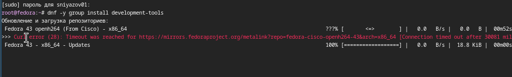
*Рисунок 15 – Ошибка подключения к репозиторию Cisco OpenH264*

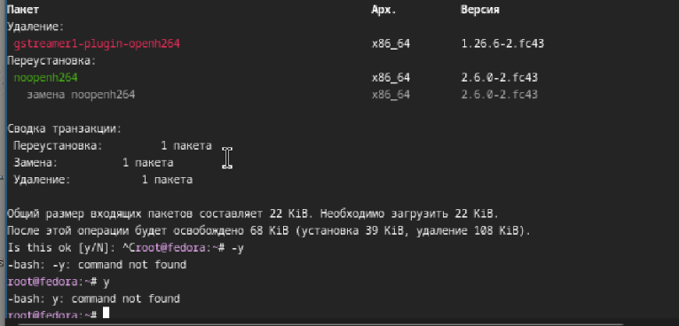
*Рисунок 16 – Замена пакета openh264 на noopenh264*

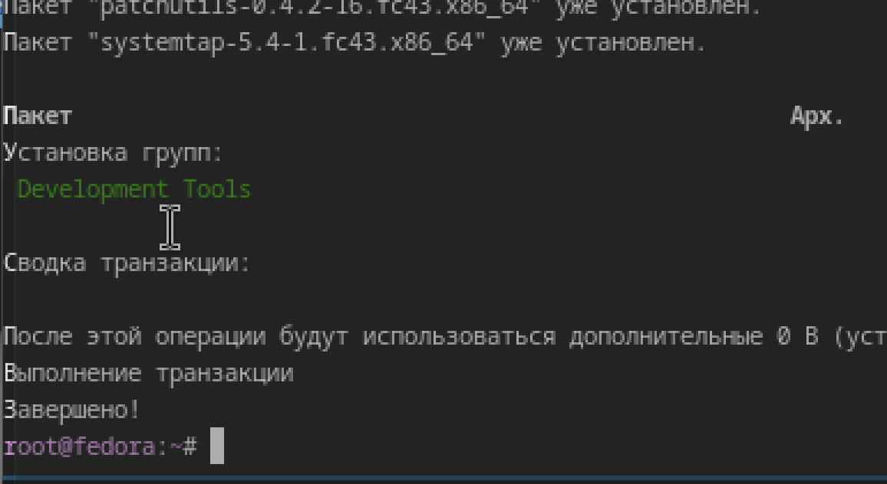
*Рисунок 17 – Завершение установки группы пакетов Development Tools*

Далее были выполнены команды для обновления всех пакетов системы и установки дополнительных полезных утилит.

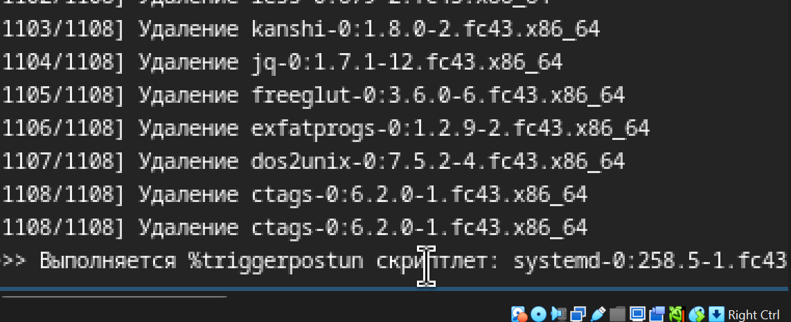
*Рисунок 18 – Процесс обновления пакетов (dnf update)*

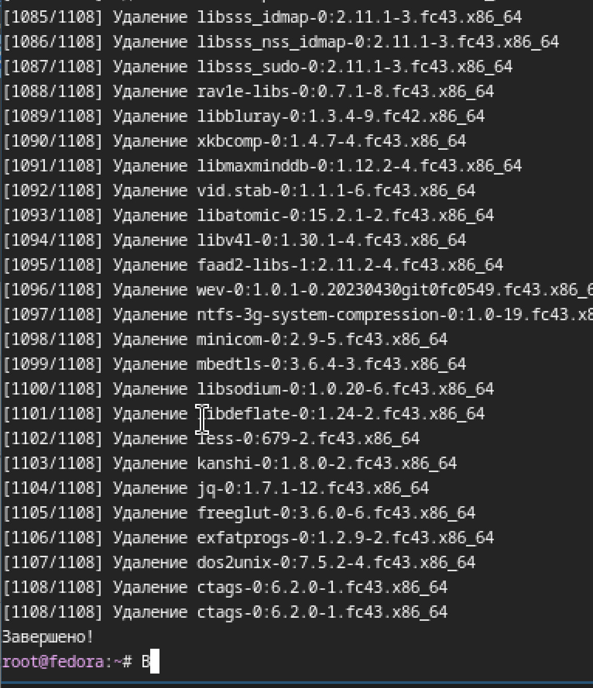
*Рисунок 19 – Успешное завершение обновления*

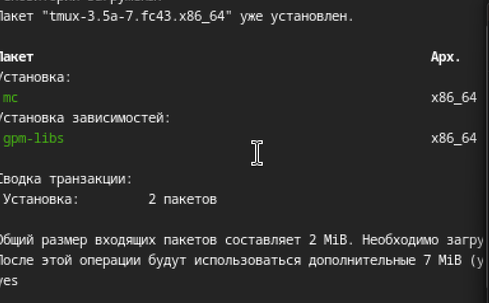
*Рисунок 20 – Установка пакетов tmux и mc*

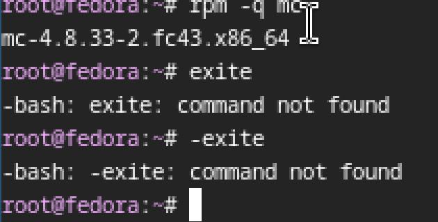
*Рисунок 21 – Проверка версии установленного пакета mc*

# 3. Домашнее задание (анализ dmesg)

В рамках домашнего задания был проведен анализ последовательности загрузки системы с помощью команды `dmesg`. Для доступа к полному журналу ядра команда выполнялась с правами суперпользователя.

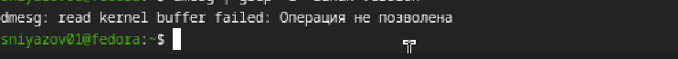
*Рисунок 22 – Попытка выполнения dmesg без прав root*

После переключения на пользователя root (команда `sudo -i`) были получены следующие результаты.
# 3.1. Версия ядра Linux

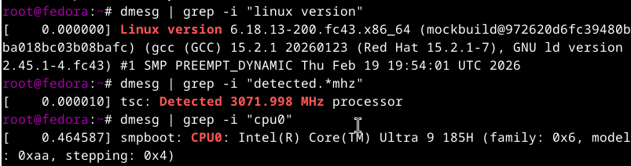
Рисунок 23 – Версия ядра Linux

# 3.2. Частота процессора

С помощью команды dmesg | grep -i "detected.*mhz" была получена информация о тактовой частоте процессора.


Рисунок 24 – Частота процессора

# 3.3. Модель процессора

Информация о модели процессора была получена командой dmesg | grep -i "cpu0".


Рисунок 25 – Модель процессора

# 3.4. Объём доступной оперативной памяти

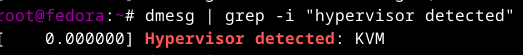
Рисунок 27 – Обнаруженный гипервизор
# 3.6. Тип файловой системы корневого раздела

Из вывода команды dmesg | grep -i "VFS" и последующих строк видно, что корневая файловая система — BTRFS.

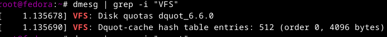
Рисунок 28 – Определение типа файловой системы корня

# 3.7. Последовательность монтирования файловых систем

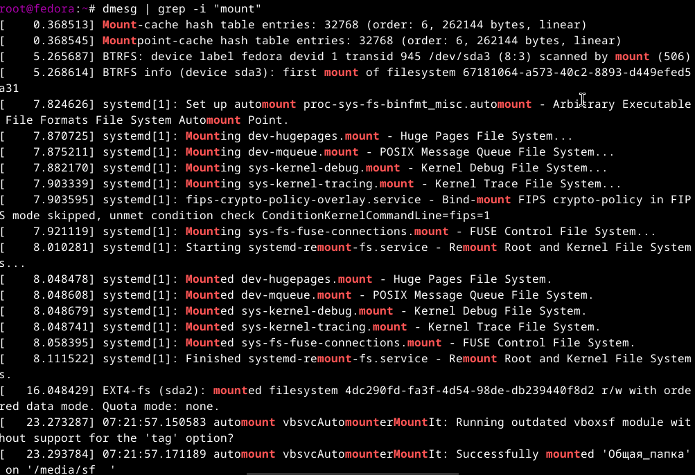
Рисунок 29 – Последовательность монтирования файловых систем

4. Ссылки
4.1. Репозиторий проекта на GitHub
Все материалы по лабораторной работе, включая исходные файлы отчёта в формате Markdown, скриншоты и скомпилированные версии (PDF, DOCX), доступны в репозитории на GitHub:

Репозиторий: https://github.com/Ghosts-23/study_2025-2026_os-intro
[    0.000000] Linux version 6.17.1-300.fc43.x86_64 (mockbuild@...) (gcc (GCC) 15.2.1 2025) #1 SMP ...