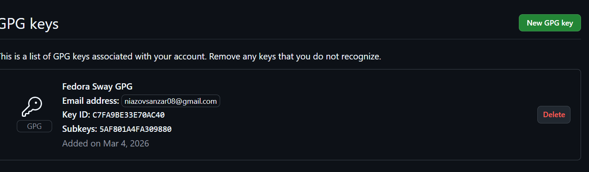
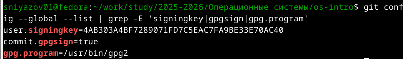
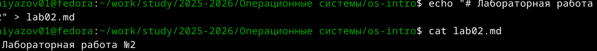
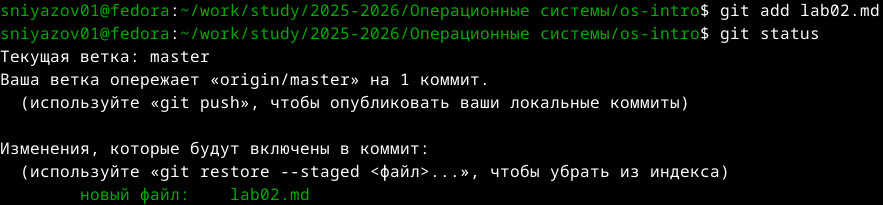
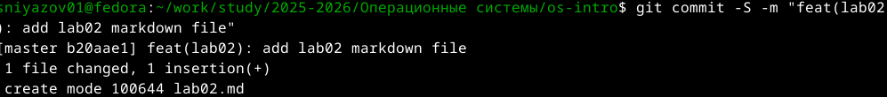
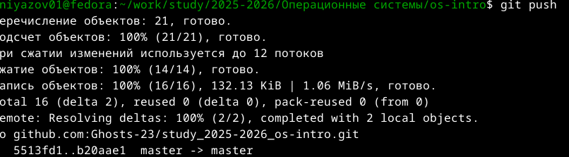
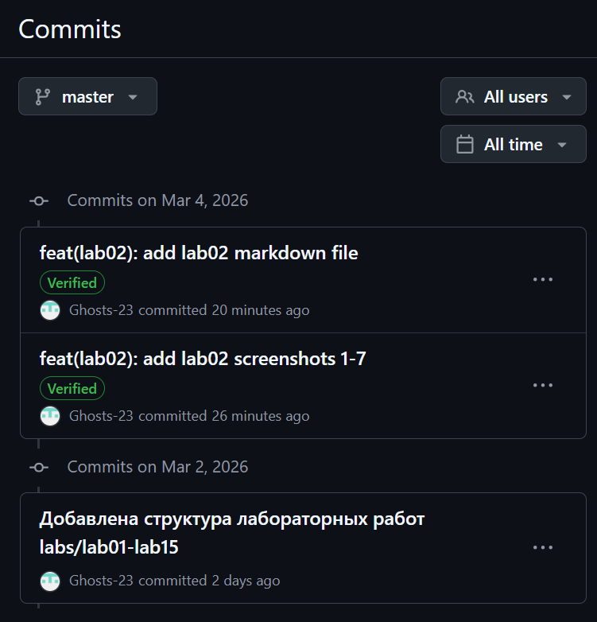

---
## Author
author:
  name: Санджар Ниязов
  degrees: 
  orcid: 
  email: niazovsanzar08@gmail.com
  affiliation:
    - name: Российский университет дружбы народов
      country: Российская Федерация
      postal-code: 117198
      city: Москва
      address: ул. Миклухо-Маклая, д. 6

## Title
title: "Отчёт по лабораторной работе №2"
subtitle: "Первоначальная настройка git"
license: "CC BY"
date: 2026-03-04
---

# Отчёт по лабораторной работе №2
## Первоначальная настройка git

**Студент:** Санджар Ниязов  
**Email:** niazovsanzar08@gmail.com  
**Дата:** 4 марта 2026 г.

# Цель работы
Изучить идеологию и применение средств контроля версий. Освоить умения по работе с git.

# Ход работы
...

## 1. Проверка и настройка Git

Были проверены и настроены основные параметры Git (рис. \ref{fig:git-config):

{#fig:git-config}

## 2. Создание PGP-ключа

Создан PGP-ключ для подписи коммитов (рис. \ref{fig:gpg-create, \ref{fig:gpg-info, \ref{fig:gpg-list):

{#fig:gpg-create}
{#fig:gpg-info}
{#fig:gpg-list}

## 3. Экспорт и добавление ключа на GitHub

Публичный ключ был экспортирован (рис. \ref{fig:gpg-export) и добавлен в настройках GitHub (рис. \ref{fig:github-gpg):

{#fig:gpg-export}
{#fig:github-gpg}

## 4. Настройка автоматической подписи коммитов

Настроена автоматическая подпись всех коммитов (рис. \ref{fig:git-signing):

{#fig:git-signing}

## 5. Создание подписанного коммита

Был создан тестовый файл (рис. \ref{fig:file-create), добавлен в git (рис. \ref{fig:git-add), выполнен подписанный коммит (рис. \ref{fig:git-commit) и отправлен на GitHub (рис. \ref{fig:git-push):

{#fig:file-create}
{#fig:git-add}
{#fig:git-commit}
{#fig:git-push}

## 6. Проверка подписи на GitHub

На GitHub коммиты отображаются с пометкой Verified (рис. \ref{fig:github-verified):

{#fig:github-verified}

## 7. Настройка GitHub CLI

Выполнена авторизация в GitHub CLI (рис. \ref{fig:gh-start, \ref{fig:gh-finish):

{#fig:gh-start}
{#fig:gh-finish}

# Вывод

В ходе лабораторной работы были изучены средства контроля версий Git, создан PGP-ключ для подписи коммитов, настроена автоматическая подпись, выполнена интеграция с GitHub и GitHub CLI. Все коммиты успешно верифицируются на GitHub.

# Контрольные вопросы

## 1. Что такое системы контроля версий (VCS) и для решения каких задач они предназначаются?

**Системы контроля версий (VCS)** — это программные инструменты, которые помогают отслеживать изменения в файлах, координировать работу над проектами и хранить историю изменений. Они предназначены для:
- Сохранения истории изменений файлов
- Возможности отката к любой предыдущей версии
- Совместной работы нескольких разработчиков
- Разрешения конфликтов при одновременном редактировании
- Ведения документации изменений (кто, когда и что изменил)

## 2. Объясните следующие понятия VCS и их отношения: хранилище, commit, история, рабочая копия.

- **Хранилище (repository)** — база данных, где хранятся все файлы и история их изменений. Может быть локальным или удалённым.
- **Commit (фиксация)** — сохранение изменений в хранилище с описанием того, что было сделано. Каждый коммит имеет уникальный идентификатор (хэш).
- **История (history)** — последовательность коммитов, отражающая эволюцию проекта. Позволяет просматривать изменения во времени.
- **Рабочая копия (working copy)** — текущая версия файлов проекта на локальном компьютере, с которой работает пользователь.

*Отношения:* Рабочая копия создаётся из хранилища. После внесения изменений пользователь делает коммит, который добавляется в историю хранилища.

## 3. Что представляют собой и чем отличаются централизованные и децентрализованные VCS? Приведите примеры VCS каждого вида.

**Централизованные VCS:**
- Единый центральный сервер с хранилищем
- Клиенты получают рабочие копии
- Для работы нужно подключение к серверу
- Примеры: CVS, Subversion (SVN)

**Децентрализованные (распределённые) VCS:**
- Каждый клиент имеет полную копию хранилища (включая историю)
- Можно работать автономно
- Примеры: Git, Mercurial, Bazaar

*Главное отличие:* В централизованных VCS история хранится только на сервере, в распределённых — у каждого разработчика есть полная копия истории.

## 4. Опишите действия с VCS при единоличной работе с хранилищем.

1. **Инициализация:** `git init` — создание локального репозитория
2. **Добавление файлов:** `git add file.txt` — добавление файлов в индекс
3. **Фиксация изменений:** `git commit -m "описание"` — создание коммита
4. **Просмотр состояния:** `git status` — проверка изменённых файлов
5. **Просмотр истории:** `git log` — просмотр истории коммитов
6. **Создание веток:** `git branch new-feature` — создание новой ветки
7. **Слияние веток:** `git merge new-feature` — объединение изменений

## 5. Опишите порядок работы с общим хранилищем VCS.

1. **Клонирование:** `git clone <url>` — получение удалённого репозитория
2. **Получение обновлений:** `git pull` — загрузка изменений из удалённого репозитория
3. **Создание ветки:** `git checkout -b feature-branch` — создание ветки для новой функциональности
4. **Внесение изменений:** редактирование файлов
5. **Коммит:** `git commit -am "описание изменений"` — фиксация изменений
6. **Отправка:** `git push` — отправка изменений в удалённый репозиторий
7. **Создание Pull Request** — запрос на слияние изменений (в GitHub/GitLab)

## 6. Каковы основные задачи, решаемые инструментальным средством git?

- Отслеживание истории изменений файлов
- Совместная работа нескольких разработчиков
- Управление ветками и слияниями
- Возможность отката к любой версии
- Резервное копирование кода
- Ведение документации изменений
- Разрешение конфликтов при параллельной работе

## 7. Назовите и дайте краткую характеристику командам git.

| Команда | Назначение |
|---------|------------|
| `git init` | Создание нового репозитория |
| `git clone` | Копирование удалённого репозитория |
| `git add` | Добавление файлов в индекс |
| `git commit` | Фиксация изменений |
| `git status` | Просмотр состояния |
| `git log` | Просмотр истории |
| `git diff` | Просмотр изменений |
| `git branch` | Управление ветками |
| `git checkout` | Переключение между ветками |
| `git merge` | Слияние веток |
| `git pull` | Получение изменений из удалённого репозитория |
| `git push` | Отправка изменений в удалённый репозиторий |
| `git remote` | Управление удалёнными репозиториями |

## 8. Приведите примеры использования при работе с локальным и удалённым репозиториями.

**Локальный репозиторий:**
```bash
mkdir project
cd project
git init
echo "# My Project" > README.md
git add README.md
git commit -m "Initial commit"
git branch feature
git checkout feature
echo "New feature" > feature.txt
git add feature.txt
git commit -m "Add new feature"
git checkout master
git merge feature

**Удалённый репозиторий:**
git clone https://github.com/user/project.git
cd project
git checkout -b new-feature
echo "Update" >> file.txt
git add file.txt
git commit -m "Add new feature"
git push origin new-feature


## 9. Что такое и зачем могут быть нужны ветви (branches)?

**Ветви (branches)** — это отдельные линии разработки, позволяющие работать над разными функциями независимо друг от друга.

**Зачем нужны:**

* Разработка новых функций без влияния на основную ветку
* Эксперименты с кодом
* Исправление ошибок в отдельных версиях
* Параллельная работа нескольких разработчиков
* Организация процесса разработки (main, develop, feature branches)

## 10. Как и зачем можно игнорировать некоторые файлы при commit?

Для игнорирования файлов используется файл **.gitignore**.

**Зачем игнорировать:**

* Временные файлы (*.tmp, *.log)
* Скомпилированные файлы (*.o, *.class)
* Конфиденциальные данные (пароли, ключи)
* Файлы среды разработки (.idea/, .vscode/)
* Папки с зависимостями (node_modules/, vendor/)

**Как игнорировать:**
*Создать файл .gitignore*
echo "*.log" >> .gitignore
echo "node_modules/" >> .gitignore
echo "config/local.php" >> .gitignore
**Добавить .gitignore в репозиторий**
git add .gitignore
git commit -m "Add .gitignore"

# Список литературы
::: {#refs}
:::


