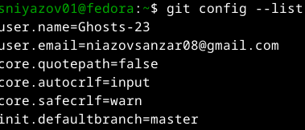
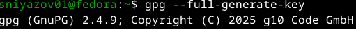
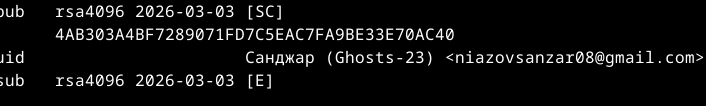
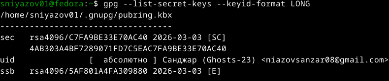
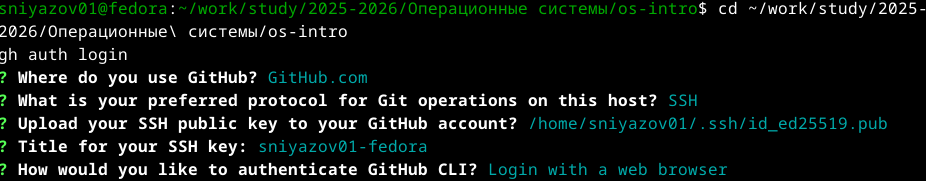
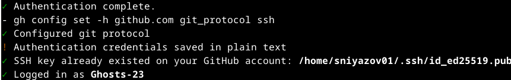

# 1. Цель работы

Изучить идеологию и применение средств контроля версий. Освоить умения по работе с git.

# 2. Задание

1. Настроить git для работы на локальном компьютере.
2. Создать PGP-ключ для подписи коммитов.
3. Настроить подпись коммитов с помощью PGP-ключа.
4. Выполнить подписанные коммиты и отправить их на GitHub.
5. Настроить GitHub CLI для работы с репозиторием.

# 3. Выполнение работы

## 3.1. Проверка и настройка Git

Были проверены и настроены основные параметры Git:



## 3.2. Создание GPG-ключа

Для подписи коммитов был создан GPG-ключ:



Ключ создан с параметрами:
- Тип: RSA и RSA
- Размер: 4096 бит
- Срок действия: бессрочно
- Имя: Санджар Ниязов
- Email: niazovsanzar08@gmail.com





## 3.3. Экспорт и добавление ключа на GitHub

Публичный ключ был экспортирован и добавлен в настройках GitHub:


## 3.4. Настройка подписи коммитов

Настроена автоматическая подпись всех коммитов:


Выполнены команды:

```
git config --global user.signingkey 4AB303A4BF7289071FD7C5EAC7FA9BE33E70AC40
git config --global commit.gpgsign true
```

## 3.5. Создание подписанного коммита

Был создан тестовый файл, добавлен в git, выполнен подписанный коммит и отправлен на GitHub:


## 3.6. Проверка подписи на GitHub

На GitHub коммиты отображаются с пометкой Verified:


## 3.7. Настройка GitHub CLI

Выполнена авторизация в GitHub CLI:





# 4. Контрольные вопросы

## 4.1. Что такое системы контроля версий (VCS) и для решения каких задач они предназначаются?

Системы контроля версий (VCS) — это программные инструменты, которые помогают отслеживать изменения в файлах, координировать работу над проектами и хранить историю изменений. Они предназначены для:
- Сохранения истории изменений файлов
- Возможности отката к любой предыдущей версии
- Совместной работы нескольких разработчиков
- Разрешения конфликтов при одновременном редактировании
- Ведения документации изменений (кто, когда и что изменил)

## 4.2. Объясните следующие понятия VCS и их отношения: хранилище, commit, история, рабочая копия.

- **Хранилище (repository)** — база данных, где хранятся все файлы и история их изменений. Может быть локальным или удалённым.
- **Commit (фиксация)** — сохранение изменений в хранилище с описанием того, что было сделано. Каждый коммит имеет уникальный идентификатор (хэш).
- **История (history)** — последовательность коммитов, отражающая эволюцию проекта. Позволяет просматривать изменения во времени.
- **Рабочая копия (working copy)** — текущая версия файлов проекта на локальном компьютере, с которой работает пользователь.

**Отношения**: Рабочая копия создаётся из хранилища. После внесения изменений пользователь делает коммит, который добавляется в историю хранилища.

## 4.3. Что представляют собой и чем отличаются централизованные и децентрализованные VCS? Приведите примеры VCS каждого вида.

**Централизованные VCS:**
- Единый центральный сервер с хранилищем
- Клиенты получают рабочие копии
- Для работы нужно подключение к серверу
- Примеры: CVS, Subversion (SVN)

**Децентрализованные (распределённые) VCS:**
- Каждый клиент имеет полную копию хранилища (включая историю)
- Можно работать автономно
- Примеры: Git, Mercurial, Bazaar

Главное отличие: В централизованных VCS история хранится только на сервере, в распределённых — у каждого разработчика есть полная копия истории.

## 4.4. Опишите действия с VCS при единоличной работе с хранилищем.

1. Инициализация: `git init` — создание локального репозитория
2. Добавление файлов: `git add file.txt` — добавление файлов в индекс
3. Фиксация изменений: `git commit -m "описание"` — создание коммита
4. Просмотр состояния: `git status` — проверка изменённых файлов
5. Просмотр истории: `git log` — просмотр истории коммитов
6. Создание веток: `git branch new-feature` — создание новой ветки
7. Слияние веток: `git merge new-feature` — объединение изменений

## 4.5. Опишите порядок работы с общим хранилищем VCS.

1. Клонирование: `git clone <url>` — получение удалённого репозитория
2. Получение обновлений: `git pull` — загрузка изменений из удалённого репозитория
3. Создание ветки: `git checkout -b feature-branch` — создание ветки для новой функциональности
4. Внесение изменений: редактирование файлов
5. Коммит: `git commit -am "описание изменений"` — фиксация изменений
6. Отправка: `git push` — отправка изменений в удалённый репозиторий
7. Создание Pull Request — запрос на слияние изменений (в GitHub/GitLab)

## 4.6. Каковы основные задачи, решаемые инструментальным средством git?

- Отслеживание истории изменений файлов
- Совместная работа нескольких разработчиков
- Управление ветками и слияниями
- Возможность отката к любой версии
- Резервное копирование кода
- Ведение документации изменений
- Разрешение конфликтов при параллельной работе

## 4.7. Назовите и дайте краткую характеристику командам git.

| Команда | Назначение |
|---------|------------|
| `git init` | Создание нового репозитория |
| `git clone` | Копирование удалённого репозитория |
| `git add` | Добавление файлов в индекс |
| `git commit` | Фиксация изменений |
| `git status` | Просмотр состояния |
| `git log` | Просмотр истории |
| `git diff` | Просмотр изменений |
| `git branch` | Управление ветками |
| `git checkout` | Переключение между ветками |
| `git merge` | Слияние веток |
| `git pull` | Получение изменений из удалённого репозитория |
| `git push` | Отправка изменений в удалённый репозиторий |
| `git remote` | Управление удалёнными репозиториями |

## 4.8. Приведите примеры использования при работе с локальным и удалённым репозиториями.

**Локальный репозиторий:**

```
mkdir project
cd project
git init
echo "# My Project" > README.md
git add README.md
git commit -m "Initial commit"
git branch feature
git checkout feature
echo "New feature" > feature.txt
git add feature.txt
git commit -m "Add new feature"
git checkout master
git merge feature
```
**Удалённый репозиторий:**

```
git clone https://github.com/user/project.git
cd project
git checkout -b new-feature
echo "Update" > file.txt
git add file.txt
git commit -m "Add new feature"
git push origin new-feature
```

## 4.9. Что такое и зачем могут быть нужны ветви (branches)?

Ветви (branches) — это отдельные линии разработки, позволяющие работать над разными функциями независимо друг от друга.

**Зачем нужны:**
- Разработка новых функций без влияния на основную ветку
- Эксперименты с кодом
- Исправление ошибок в отдельных версиях
- Параллельная работа нескольких разработчиков
- Изоляция стабильного кода от разрабатываемого

## 4.10. Как и зачем можно игнорировать некоторые файлы при commit?

Для игнорирования файлов используется файл `.gitignore`.

**Зачем игнорировать:**
- Временные файлы (.tmp, .log)
- Скомпилированные файлы (.o, .class)
- Конфиденциальные данные (пароли, ключи)
- Файлы среды разработки (.idea/, .vscode/)
- Папки с зависимостями (node_modules/, vendor/)

**Как игнорировать:**

```
Создать файл .gitignore
echo "*.log" >> .gitignore
echo "node_modules/" >> .gitignore
echo "config/local.php" >> .gitignore
```


```
Добавить .gitignore в репозиторий
git add .gitignore
git commit -m "Add .gitignore"
```

# 5. Выводыs

В ходе лабораторной работы были изучены средства контроля версий Git, создан PGP-ключ для подписи коммитов, настроена автоматическая подпись, выполнена интеграция с GitHub и GitHub CLI. Все коммиты успешно верифицируются на GitHub. Также были освоены основные приёмы работы с Markdown для оформления технической документации.

# 6. Список литературы

1. Таненбаум Э., Бос Х. Современные операционные системы. 4-е изд. СПб.: Питер, 2015. 1120 с.
2. Robbins A. Bash Pocket Reference. O'Reilly Media, 2016. 156 с.
3. Zarrelli G. Mastering Bash. Packt Publishing, 2017. 502 с.