# Цель работы

Получение навыков правильной работы с репозиториями git, а именно: освоение модели ветвления Gitflow, семантического версионирования и стандартизации коммитов (Conventional Commits).

# Задание

1. Установить необходимое ПО (git-flow, Node.js, pnpm).
2. Настроить инструменты для семантического версионирования и общепринятых коммитов (commitizen, standard-changelog).
3. Создать тестовый репозиторий `git-extended` на GitHub.
4. Инициализировать в нем git-flow.
5. Выполнить релиз версии 1.0.0 с созданием журнала изменений (CHANGELOG.md).
6. Создать релиз на GitHub с помощью `gh`.
7. Выполнить сценарий разработки новой функциональности и создать следующий релиз 1.2.3.

# Теоретические сведения

## Рабочий процесс Gitflow

Gitflow Workflow — это строгая модель ветвления с учётом выпуска проекта. Данная модель отлично подходит для организации рабочего процесса на основе релизов.

Последовательность действий при работе по модели Gitflow:
- Из ветки `master` создаётся ветка `develop`
- Из ветки `develop` создаются ветки `feature` для новых функций
- Из ветки `develop` создаётся ветка `release` для подготовки релиза
- Когда работа над веткой `feature` завершена, она сливается с веткой `develop`
- Когда работа над веткой релиза `release` завершена, она сливается в ветки `develop` и `master`
- Для срочных исправлений из `master` создаётся ветка `hotfix`

## Семантическое версионирование

Семантическое версионирование (SemVer) описывается в манифесте семантического версионирования. Версия задаётся в виде кортежа `МАЖОРНАЯ.МИНОРНАЯ.ПАТЧ`:
- **МАЖОРНАЯ** версия увеличивается при обратно несовместимых изменениях API
- **МИНОРНАЯ** версия увеличивается при добавлении новой функциональности с обратной совместимостью
- **ПАТЧ** увеличивается при обратно совместимых исправлениях ошибок

## Общепринятые коммиты

Спецификация Conventional Commits регламентирует структуру сообщений коммитов:

```
<type>(<scope>): <subject>
<BLANK LINE>
<body>
<BLANK LINE>
<footer>
```

Основные типы коммитов:
- `feat:` — новая функциональность (MINOR)
- `fix:` — исправление ошибок (PATCH)
- `chore:` — обслуживание кода
- `docs:` — изменения в документации
- `style:` — форматирование кода
- `refactor:` — рефакторинг
- `test:` — добавление тестов

# Выполнение лабораторной работы

## Установка программного обеспечения

### Установка git-flow

В связи с отсутствием пакета в стандартных репозиториях Fedora 43, git-flow был установлен из исходников:

```bash
# Клонирование репозитория git-flow
cd ~/Downloads
git clone https://github.com/nvie/gitflow.git
cd gitflow

# Инициализация подмодулей
git submodule update --init --recursive

# Установка
sudo make install

# Проверка версии
git flow version
```

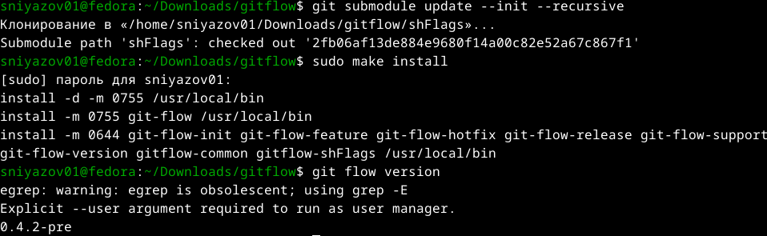{#fig:gitflow-install}

### Установка Node.js и pnpm

```bash
# Установка Node.js
sudo dnf install nodejs
node --version
```

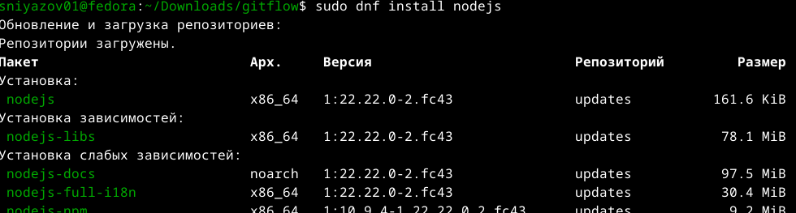{#fig:node-install}

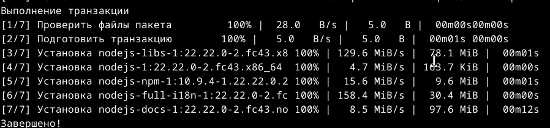{#fig:node-install2}

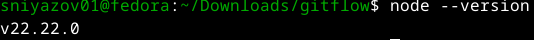{#fig:node-version}

```bash
# Установка pnpm
sudo dnf install pnpm
pnpm setup
source ~/.bashrc
```

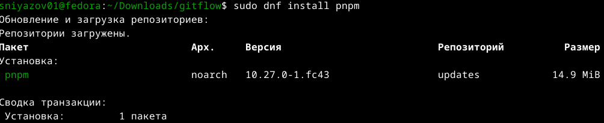{#fig:pnpm-install}

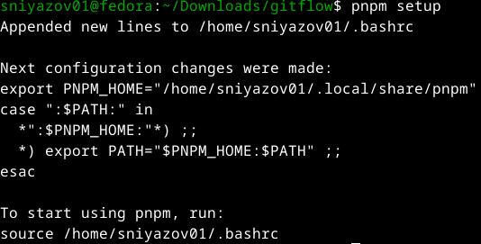{#fig:pnpm-setup}

### Установка инструментов для Conventional Commits

```bash
# Установка commitizen
pnpm add -g commitizen

# Установка standard-changelog
pnpm add -g standard-changelog

# Проверка установки
which git-cz
which standard-changelog
```

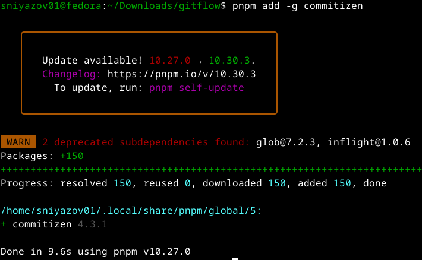{#fig:commitizen-install}

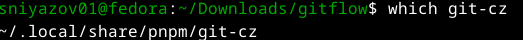{#fig:gitcz-check}

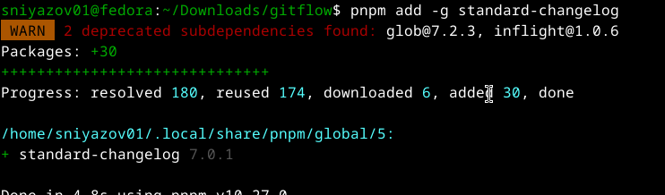{#fig:stdchangelog-install}

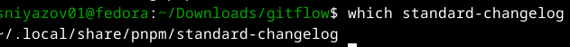{#fig:stdchangelog-check}

## Создание и настройка тестового репозитория

### Создание репозитория на GitHub

На GitHub был создан публичный репозиторий `git-extended` с описанием на русском языке.

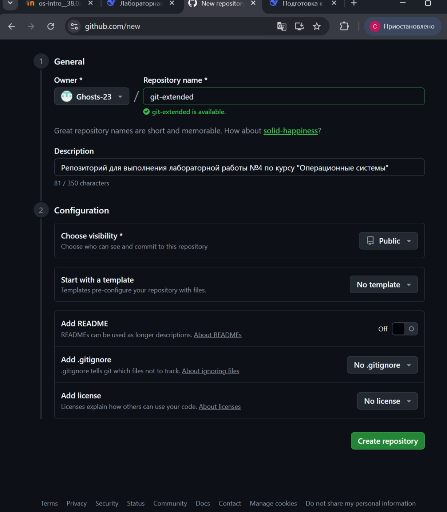{#fig:github-repo}

### Инициализация локального репозитория

```bash
# Создание директории и инициализация репозитория
mkdir -p ~/work/study/2025-2026/Операционные\ системы/git-extended
cd ~/work/study/2025-2026/Операционные\ системы/git-extended
git init
git commit --allow-empty -m "first commit"
git remote add origin git@github.com:Ghosts-23/git-extended.git
git push -u origin master
```

### Инициализация Node.js пакета

```bash
pnpm init
```

Был создан файл `package.json` со следующими параметрами:
- **name**: `git-extended`
- **version**: `1.0.0`
- **description**: `Git repo for educational purposes`
- **author**: `Niyazov Sanzhar <niazovsanzar08@gmail.com>`
- **license**: `CC-BY-4.0`
- **repository**: `git@github.com:Ghosts-23/git-extended.git`

### Настройка commitizen

В файл `package.json` была добавлена секция `config`:

```json
{
  "name": "git-extended",
  "version": "1.0.0",
  "description": "Git repo for educational purposes",
  "main": "index.js",
  "repository": "git@github.com:Ghosts-23/git-extended.git",
  "author": "Niyazov Sanzhar <niazovsanzar08@gmail.com>",
  "license": "CC-BY-4.0",
  "config": {
    "commitizen": {
      "path": "cz-conventional-changelog"
    }
  }
}
```

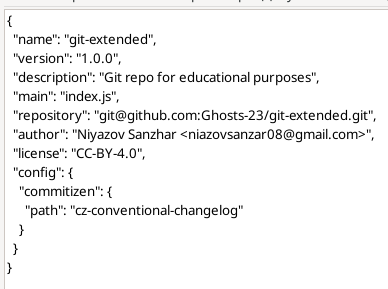{#fig:package-json}

### Первый conventional commit

```bash
git add package.json
git cz
```

Был выбран тип коммита `chore` с описанием `add package.json with commitizen config`.

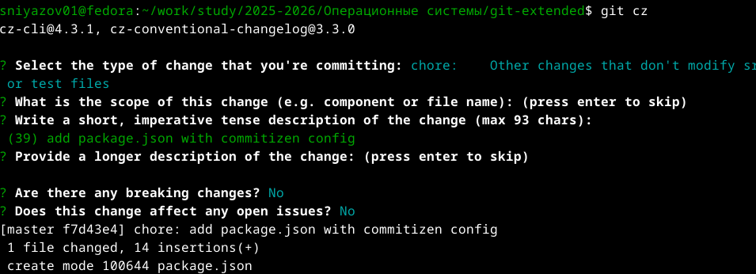{#fig:first-commit}

```bash
git push --set-upstream origin master
```

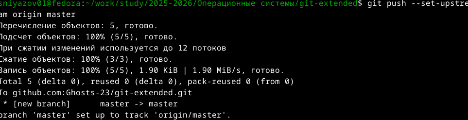{#fig:first-push}

## Работа с Gitflow

### Инициализация git-flow

```bash
git flow init
```

Были оставлены значения по умолчанию, кроме параметра `Version tag prefix`, который был установлен в `v`.

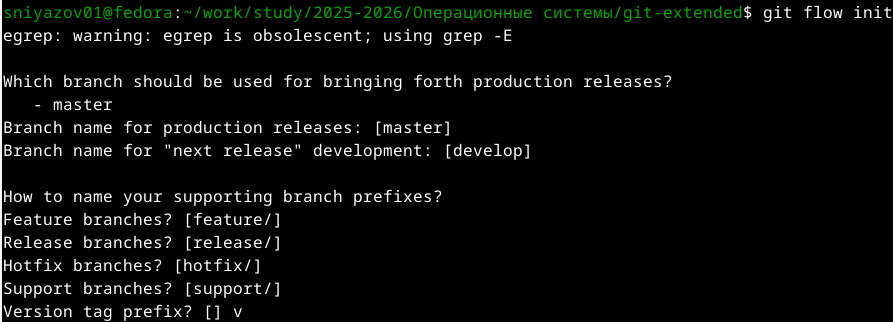{#fig:gitflow-init}

### Отправка веток на GitHub

```bash
git push --all
git branch --set-upstream-to=origin/develop develop
```

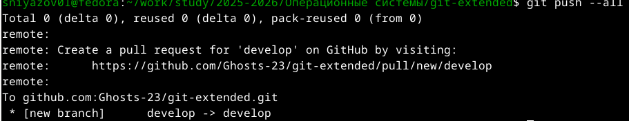{#fig:push-all}

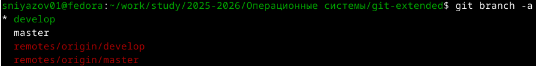{#fig:branches}

## Создание первого релиза (v1.0.0)

### Создание релизной ветки

```bash
git flow release start 1.0.0
```

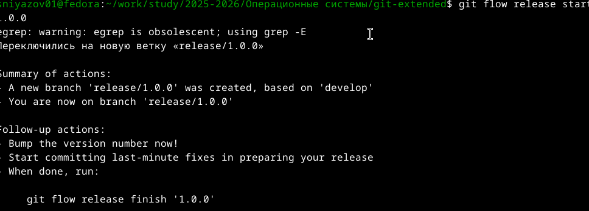{#fig:release-start}

### Генерация CHANGELOG.md

```bash
standard-changelog --first-release
cat CHANGELOG.md
```

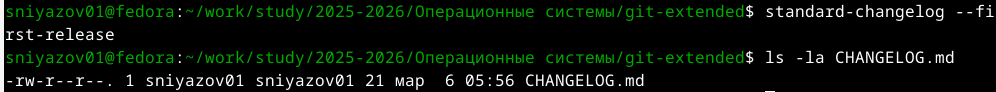{#fig:changelog-create}

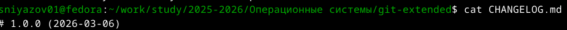{#fig:changelog-content}

### Коммит изменений

```bash
git add CHANGELOG.md
git cz
```

Был выбран тип коммита `chore` с описанием `add changelog for v1.0.0`.

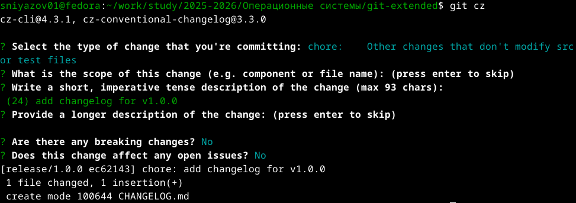{#fig:changelog-commit}

### Завершение релиза

```bash
git flow release finish 1.0.0
```

При завершении релиза было введено сообщение для тега `Release v1.0.0`.

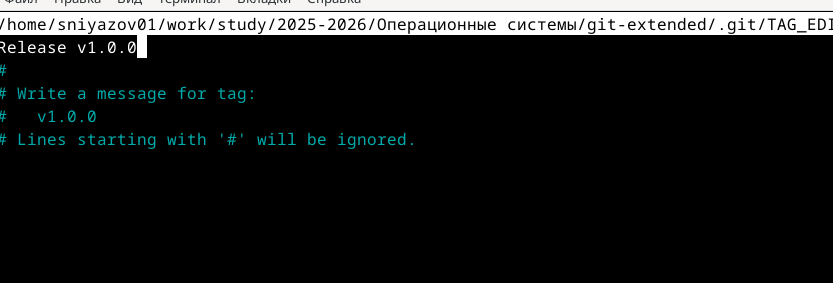{#fig:tag-message}

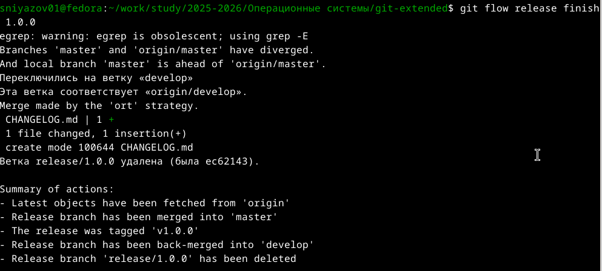{#fig:release-finish}

### Отправка изменений на GitHub

```bash
git push --all
git push --tags
```

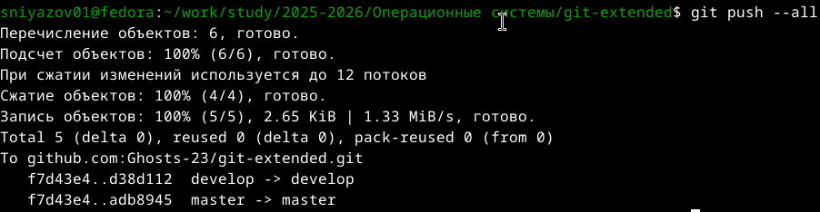{#fig:push-after-release}

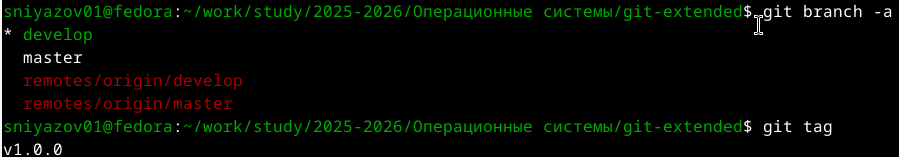{#fig:tags-check}

### Создание релиза на GitHub

```bash
gh release create v1.0.0 -F CHANGELOG.md
gh release list
```

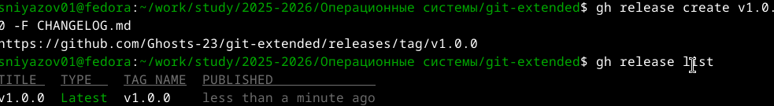{#fig:gh-release-create}

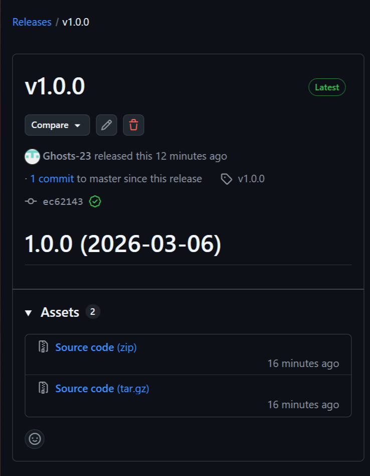{#fig:github-release}

## Разработка новой функциональности

### Создание feature-ветки

```bash
git flow feature start feature_branch
```

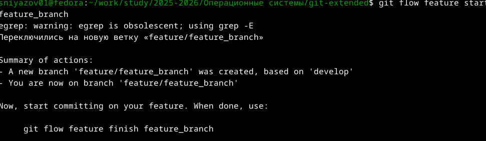{#fig:feature-start}

### Добавление новой функциональности

```bash
echo "This is a new feature for version 1.2.3" > feature.txt
git add feature.txt
git cz
```

Был выбран тип коммита `feat` с описанием `add feature.txt for version 1.2.3`.

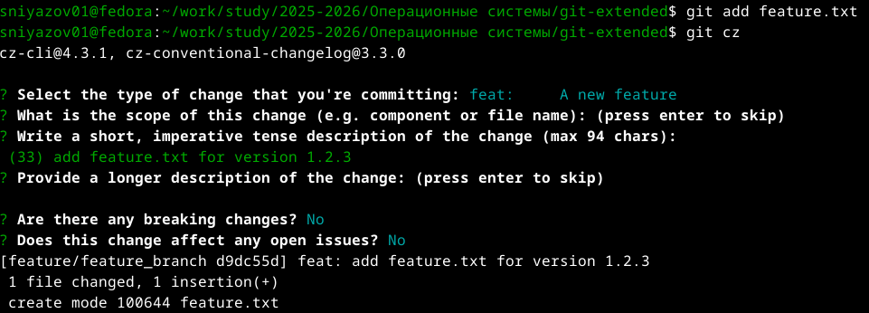{#fig:feature-commit}

### Завершение feature-ветки

```bash
git flow feature finish feature_branch
```

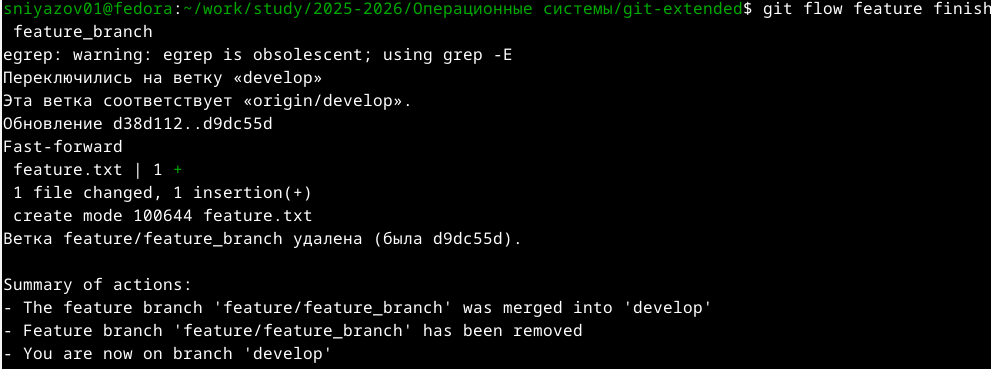{#fig:feature-finish}

## Создание второго релиза (v1.2.3)

### Создание релизной ветки

```bash
git flow release start 1.2.3
```

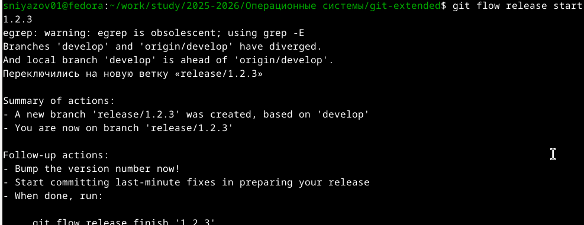{#fig:release-start-123}

### Обновление версии в package.json

В файле `package.json` версия была изменена с `1.0.0` на `1.2.3`.

### Обновление CHANGELOG.md

```bash
standard-changelog
cat CHANGELOG.md
```

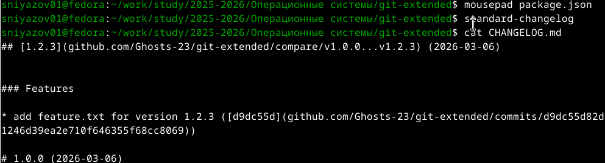{#fig:changelog-update}

### Коммит изменений

```bash
git add package.json CHANGELOG.md
git cz
```

Был выбран тип коммита `chore` с областью `release` и описанием `bump version to 1.2.3 and update changelog`.

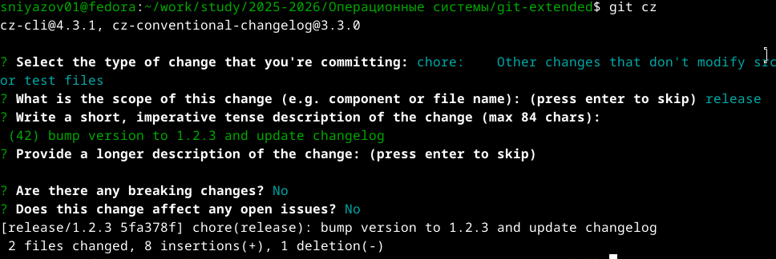{#fig:release-commit-123}

### Завершение релиза

```bash
git flow release finish 1.2.3
```

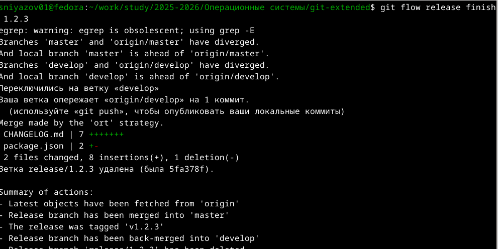{#fig:release-finish-123}

### Отправка на GitHub и создание релиза

```bash
git push --all
git push --tags
gh release create v1.2.3 -F CHANGELOG.md
```

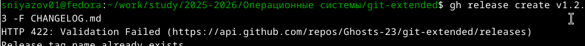{#fig:gh-release-123}

# Результаты работы

## Созданные репозитории и файлы

- **Тестовый репозиторий:** `git-extended` на GitHub
- **Файлы:**
  - `package.json` - конфигурация Node.js проекта
  - `CHANGELOG.md` - журнал изменений для версий 1.0.0 и 1.2.3
  - `feature.txt` - файл с новой функциональностью

## Созданные релизы

| Версия | Дата | Описание |
|:-------|:-----|:---------|
| v1.0.0 | 2026-03-06 | Начальный релиз |
| v1.2.3 | 2026-03-06 | Релиз с новой функциональностью |

## Ссылки

- Тестовый репозиторий: [https://github.com/Ghosts-23/git-extended](https://github.com/Ghosts-23/git-extended)
- Релиз v1.0.0: [https://github.com/Ghosts-23/git-extended/releases/tag/v1.0.0](https://github.com/Ghosts-23/git-extended/releases/tag/v1.0.0)
- Релиз v1.2.3: [https://github.com/Ghosts-23/git-extended/releases/tag/v1.2.3](https://github.com/Ghosts-23/git-extended/releases/tag/v1.2.3)

# Использованные инструменты

| Инструмент | Назначение |
|:-----------|:-----------|
| **git-flow** | Расширение Git для реализации модели ветвления |
| **Node.js/pnpm** | Среда выполнения и менеджер пакетов для утилит |
| **commitizen** | Интерактивное создание коммитов по стандарту |
| **standard-changelog** | Генерация CHANGELOG.md на основе истории коммитов |
| **GitHub CLI (`gh`)** | Создание релизов прямо из терминала |

# Выводы

В ходе выполнения лабораторной работы №4 были получены практические навыки профессиональной работы с Git:

1. **Освоена модель ветвления Gitflow**, позволяющая эффективно организовывать разработку, выпуск релизов и исправление ошибок. Были созданы и успешно использованы ветки `feature`, `release`, `develop` и `master`.

2. **Изучены принципы семантического версионирования (SemVer)** для присвоения осмысленных номеров версий. Версии `1.0.0` и `1.2.3` были присвоены в соответствии с этим стандартом.

3. **Внедрена спецификация Conventional Commits**, которая стандартизирует историю изменений. Все коммиты создавались с помощью `git-cz` с указанием типа (`feat`, `chore`) и описания.

4. **Настроен инструментарий** (`commitizen`, `standard-changelog`, `gh`), автоматизирующий рутинные операции:
   - `commitizen` обеспечил единообразное оформление коммитов
   - `standard-changelog` автоматически сгенерировал `CHANGELOG.md` на основе истории коммитов
   - `gh release create` позволил создать релизы на GitHub прямо из терминала

5. **Практически отработан полный цикл разработки**:
   - Создание репозитория и настройка окружения
   - Разработка новой функциональности в отдельной ветке
   - Подготовка и выпуск релизов
   - Публикация релизов на GitHub

Полученные навыки и инструменты являются стандартом де-факто в современной индустрии разработки программного обеспечения и могут быть применены в дальнейших лабораторных работах и реальных проектах.

# Контрольные вопросы

1. **Что такое системы контроля версий (VCS) и для чего они нужны?**  
   Системы контроля версий позволяют отслеживать изменения в файлах, работать над проектом совместно, возвращаться к предыдущим версиям и анализировать историю изменений.

2. **В чём разница между централизованными и децентрализованными VCS?**  
   В централизованных VCS (например, SVN) есть единый сервер с репозиторием. В децентрализованных (Git) каждый разработчик имеет полную копию репозитория локально.

3. **Что такое Gitflow и какие ветки в нём используются?**  
   Gitflow — это модель ветвления, использующая ветки: `master` (стабильные релизы), `develop` (разработка), `feature/*` (новые функции), `release/*` (подготовка релизов), `hotfix/*` (срочные исправления).

4. **Что такое семантическое версионирование (SemVer)?**  
   Это стандарт присвоения версий в формате `MAJOR.MINOR.PATCH`, где:
   - MAJOR — несовместимые изменения API
   - MINOR — новая функциональность с обратной совместимостью
   - PATCH — исправления ошибок с обратной совместимостью

5. **Какие типы коммитов существуют в спецификации Conventional Commits?**  
   Основные типы: `feat` (новая функция), `fix` (исправление), `docs` (документация), `style` (форматирование), `refactor` (рефакторинг), `perf` (производительность), `test` (тесты), `chore` (обслуживание).

6. **Для чего нужен файл CHANGELOG.md?**  
   Для ведения журнала изменений проекта, чтобы пользователи и разработчики могли видеть, что изменилось в каждой версии.

7. **Что делает команда `git flow release finish`?**  
   Завершает работу над релизом: вливает релизную ветку в `master` и `develop`, создаёт тег с номером версии, удаляет релизную ветку.

8. **Для чего используется GitHub CLI (`gh`)?**  
   Для управления репозиториями, создания релизов, работы с pull request и другими функциями GitHub прямо из командной строки.

# Список использованных источников

1. Документация Git: [https://git-scm.com/doc](https://git-scm.com/doc)
2. Документация Gitflow: [https://www.atlassian.com/git/tutorials/comparing-workflows/gitflow-workflow](https://www.atlassian.com/git/tutorials/comparing-workflows/gitflow-workflow)
3. Семантическое версионирование: [https://semver.org/](https://semver.org/)
4. Conventional Commits: [https://www.conventionalcommits.org/](https://www.conventionalcommits.org/)
5. Документация Quarto: [https://quarto.org/](https://quarto.org/)

# Приложение: Команды для компиляции отчёта

```bash
# Переход в директорию с отчётом
cd ~/work/study/2025-2026/Операционные\ системы/os-intro/labs/lab04/report/

# Компиляция в PDF, DOCX, HTML
quarto render os-intro-lab04-report.qmd

# Создание архива для сдачи
tar -czf lab04-report.tar.gz \
  os-intro-lab04-report.qmd \
  _output/os-intro-lab04-report.pdf \
  _output/os-intro-lab04-report.docx \
  _output/os-intro-lab04-report.html \
  image/

# Создание релиза на GitHub (основного репозитория)
git tag -a 4.0.0 -m "Lab 4 final with PDF, DOCX, HTML and archive"
git push origin 4.0.0
```
