---
title: "Лабораторная работа №5"
subtitle: "Менеджер паролей pass и управление конфигурацией chezmoi"
author: "Ниязов Санджар"
institute: "Российский университет дружбы народов"
date: "10 марта 2026"
format: pdf
---

# Введение

**Цель работы:** Освоить работу с менеджером паролей pass и системой управления конфигурационными файлами chezmoi.

**Задачи:**
1. Установить и настроить менеджер паролей pass
2. Настроить синхронизацию хранилища паролей через Git
3. Освоить работу с GPG-ключами
4. Установить и настроить chezmoi для управления конфигурационными файлами
5. Научиться работать с шаблонами chezmoi

# Теоретическое введение

## Менеджер паролей pass

pass — это менеджер паролей, следующий философии Unix. Данные хранятся в файловой системе в виде каталогов и файлов, каждый файл шифруется с помощью GPG-ключа. pass также называют "стандартным менеджером паролей для Unix".

**Основные свойства:**
- Хранение в файловой системе
- Шифрование GPG
- Интеграция с Git для синхронизации
- Простота и надёжность

## Управление конфигурацией с chezmoi

chezmoi — инструмент для управления dotfiles (конфигурационными файлами) в домашнем каталоге пользователя. Он позволяет:
- Хранить конфиги в Git-репозитории
- Использовать шаблоны для разных машин
- Безопасно управлять секретами
- Автоматизировать настройку новых систем

# Ход выполнения работы

## 1. Подготовка GPG-ключа

Перед началом работы с pass необходимо убедиться в наличии GPG-ключа. Выполним проверку существующих ключей:

```bash
gpg --list-secret-keys
gpg --list-public-keys
```

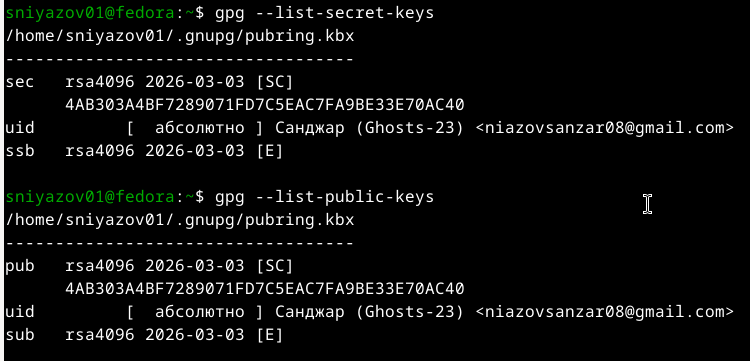{#fig:001}

На скриншоте видно, что у нас уже есть GPG-ключ с идентификатором `4AB303A4BF7289071FD7C5EAC7FA9BE33E70AC40`, созданный 3 марта 2026 года.

## 2. Установка и инициализация pass

Устанавливаем менеджер паролей pass и дополнительный модуль pass-otp:

```bash
sudo dnf install pass pass-otp
```

Инициализируем хранилище с использованием нашего GPG-ключа:

```bash
pass init "4AB303A4BF7289071FD7C5EAC7FA9BE33E70AC40"
```

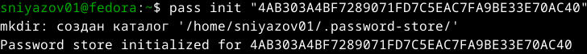{#fig:002}

Хранилище успешно создано в каталоге `~/.password-store/`.

## 3. Настройка Git-синхронизации

Для синхронизации паролей между устройствами инициализируем Git-репозиторий в хранилище:

```bash
pass git init
```

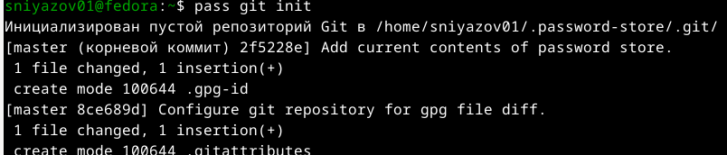{#fig:003}

Проверяем статус Git-репозитория:

```bash
pass git status
```

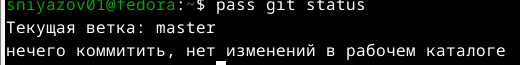{#fig:004}

## 4. Создание удалённого репозитория на GitHub

Создаём приватный репозиторий `password-store` на GitHub для хранения зашифрованных паролей:

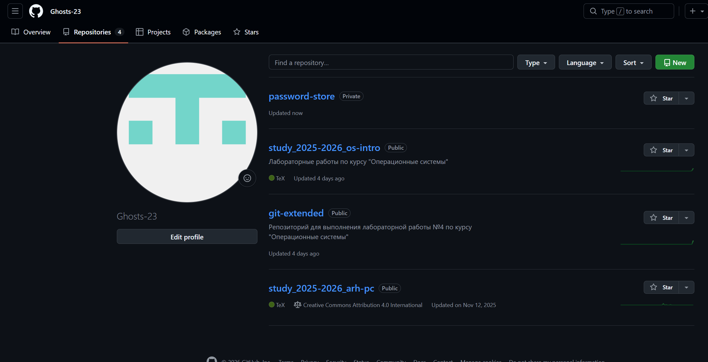{#fig:005}

Подключаем удалённый репозиторий и отправляем первый коммит:

```bash
pass git remote add origin git@github.com:Ghosts-23/password-store.git
pass git add .
pass git commit -m "Initial commit of password store"
pass git push -u origin master
```

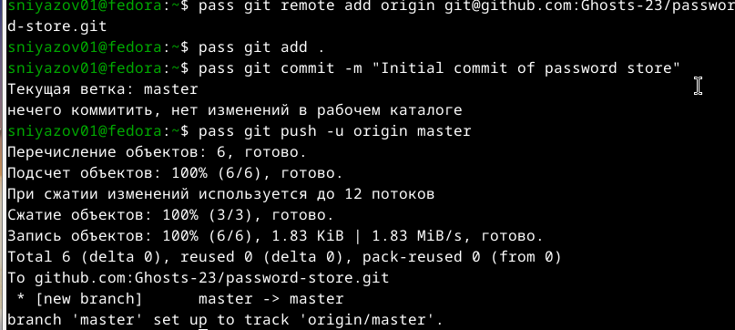{#fig:006}

Проверяем историю коммитов:

```bash
pass git log --oneline
```

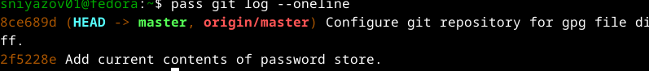{#fig:007}

## 5. Работа с паролями

### Добавление пароля

Добавляем тестовый пароль для github.com:

```bash
pass insert github.com/test
```

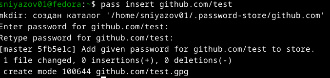{#fig:008}

### Просмотр пароля

Просматриваем сохранённый пароль:

```bash
pass github.com/test
```

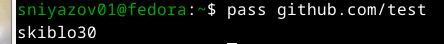{#fig:009}

### Генерация пароля

Генерируем новый пароль длиной 16 символов:

```bash
pass generate github.com/new 16
```

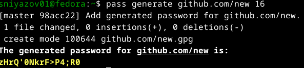{#fig:010}

### Просмотр структуры хранилища

Просматриваем все сохранённые записи:

```bash
pass show
```

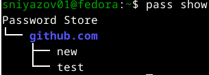{#fig:011}

### Отправка изменений на GitHub

Проверяем статус и отправляем новые пароли в удалённый репозиторий:

```bash
pass git status
pass git add .
pass git commit -m "Add test passwords"
pass git push
```

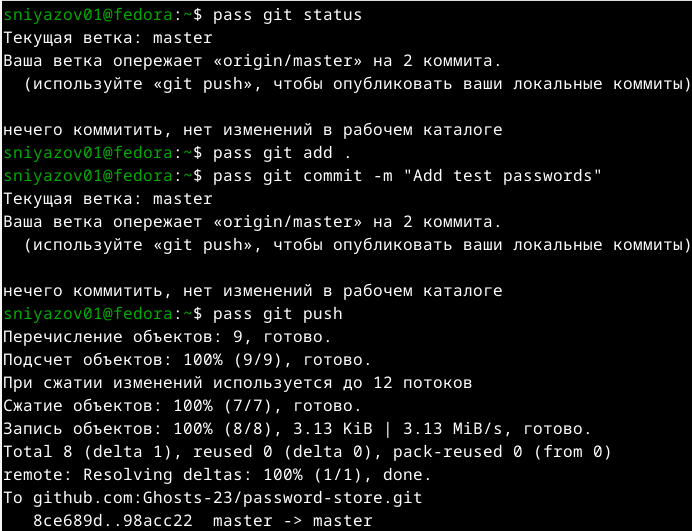{#fig:012}

## 6. Установка дополнительного программного обеспечения

Устанавливаем пакеты, необходимые для дальнейшей работы:

```bash
sudo dnf -y install \
    dunst \
    fontawesome-fonts \
    powerline-fonts \
    light \
    fuzzel \
    swaylock \
    kitty \
    waybar \
    swaybg \
    wl-clipboard \
    mpv \
    grim \
    slurp
```

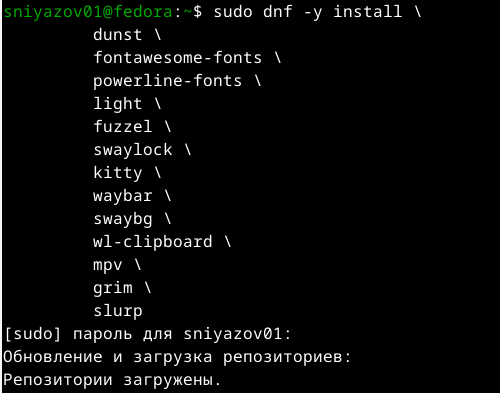{#fig:013}

## 7. Установка chezmoi

Устанавливаем chezmoi с помощью официального скрипта:

```bash
sh -c "$(wget -qO- chezmoi.io/get)"
```

Проверяем версию установленного chezmoi:

```bash
chezmoi --version
```

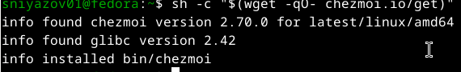{#fig:014}
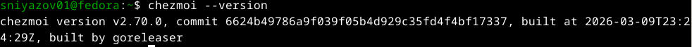{#fig:015}

## 8. Создание репозитория для конфигурационных файлов

Создаём приватный репозиторий `dotfiles` на GitHub для хранения конфигурационных файлов:

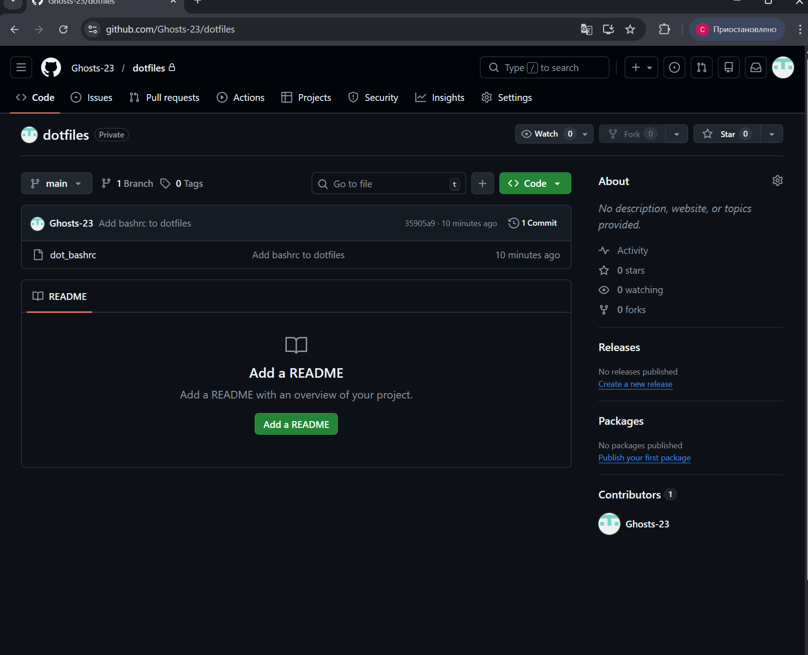{#fig:025}

Инициализируем chezmoi с нашим репозиторием:

```bash
chezmoi init git@github.com:Ghosts-23/dotfiles.git
```

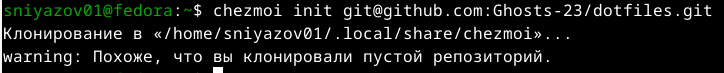{#fig:016}

Повторная установка и проверка:

```bash
sh -c "$(wget -qO- chezmoi.io/get)"
chezmoi --version
chezmoi init git@github.com:Ghosts-23/dotfiles.git
chezmoi diff
chezmoi apply -v
```

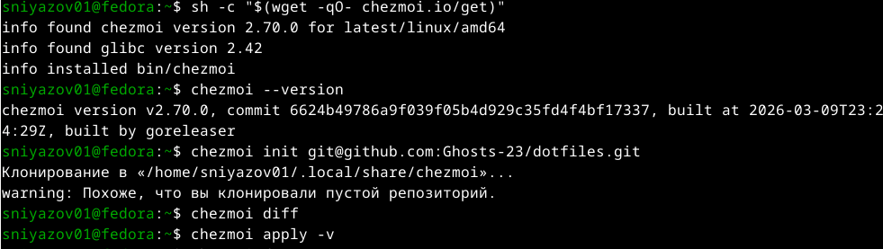{#fig:017}

## 9. Изучение шаблонов chezmoi

Просматриваем доступные переменные шаблона:

```bash
chezmoi data
```

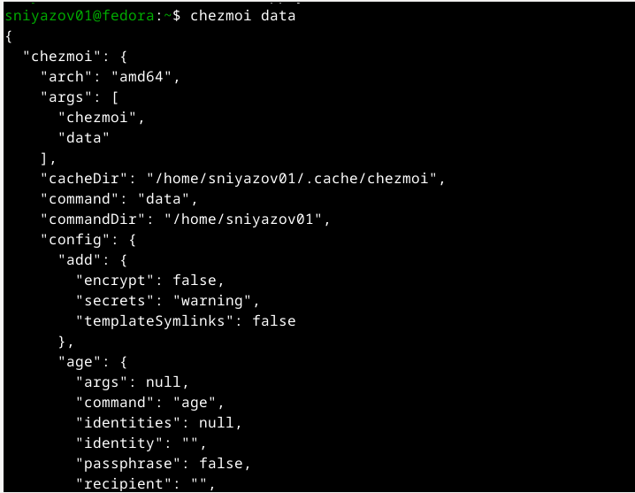{#fig:018}

Тестируем простой шаблон с именем хоста:

```bash
chezmoi execute-template '{{ .chezmoi.hostname }}'
```

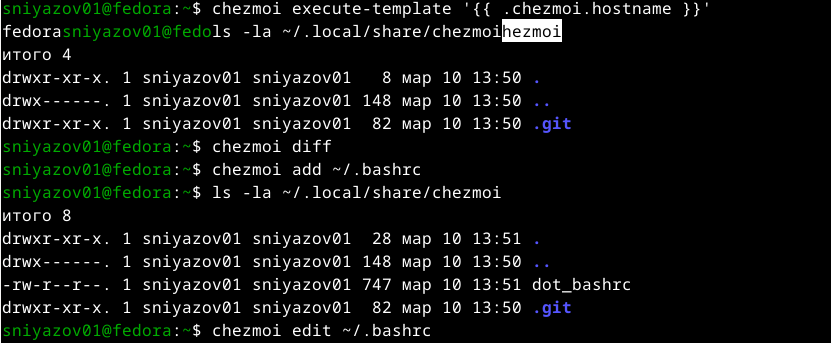{#fig:019}

## 10. Добавление конфигурационных файлов

Добавляем файл `.bashrc` под управление chezmoi:

```bash
chezmoi add ~/.bashrc
ls -la ~/.local/share/chezmoi
```

{#fig:020}

Редактируем файл через chezmoi:

```bash
chezmoi edit ~/.bashrc
```

В редакторе добавляем комментарий `# Managed by chezmoi`.

Проверяем изменения:

```bash
chezmoi diff
```

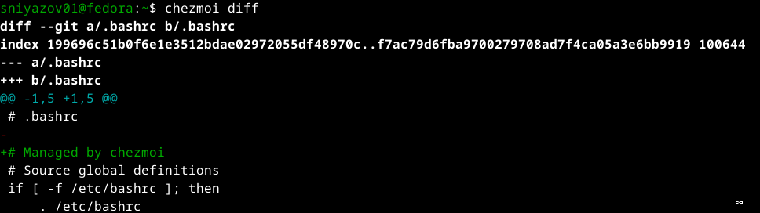{#fig:021}
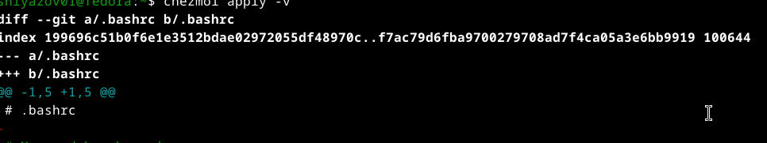{#fig:022}

Применяем изменения:

```bash
chezmoi apply -v
```

## 11. Отправка конфигурации в репозиторий

Сохраняем изменения в Git-репозитории:

```bash
cd ~/.local/share/chezmoi
git add .
git commit -m "Add bashrc to dotfiles"
git push
```

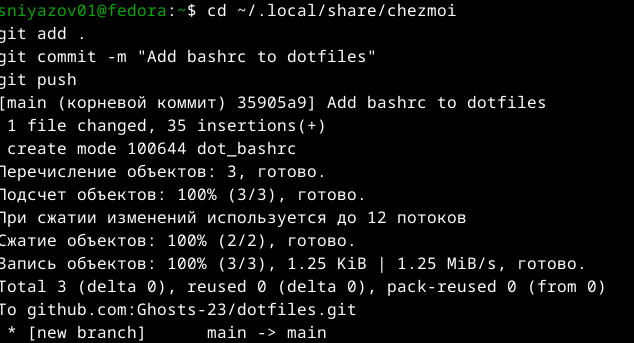{#fig:023}

## 12. Прямые изменения в хранилище паролей

Демонстрируем возможность ручного добавления файлов в хранилище паролей:

```bash
cd ~/.password-store/
echo "manual edit" >> test-file.txt
git add .
git commit -m "Manual edit example"
git push
```

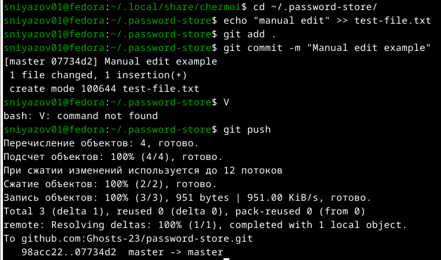{#fig:024}

# Заключение

В ходе выполнения лабораторной работы были достигнуты следующие результаты:

1. **Настроен менеджер паролей pass**:
   - Создан и настроен GPG-ключ
   - Инициализировано хранилище паролей
   - Настроена Git-синхронизация с удалённым репозиторием
   - Освоены основные операции: добавление, просмотр, генерация паролей

2. **Настроена система управления конфигурацией chezmoi**:
   - Установлен и настроен chezmoi
   - Создан приватный репозиторий для dotfiles
   - Добавлен под управление файл `.bashrc`
   - Освоена работа с шаблонами и переменными
   - Настроена синхронизация конфигурационных файлов

3. **Приобретены практические навыки**:
   - Работа с GPG-ключами
   - Использование Git для синхронизации конфиденциальных данных
   - Управление конфигурационными файлами с помощью chezmoi
   - Работа с шаблонами для адаптации конфигурации под разные машины

Все запланированные задачи выполнены, полученные навыки могут быть использованы для безопасного хранения паролей и эффективного управления конфигурациями на различных рабочих станциях.

# Список использованных источников

1. Документация pass: https://www.passwordstore.org/
2. Документация chezmoi: https://www.chezmoi.io/
3. Git documentation: https://git-scm.com/doc
4. GNU Privacy Guard: https://gnupg.org/documentation/