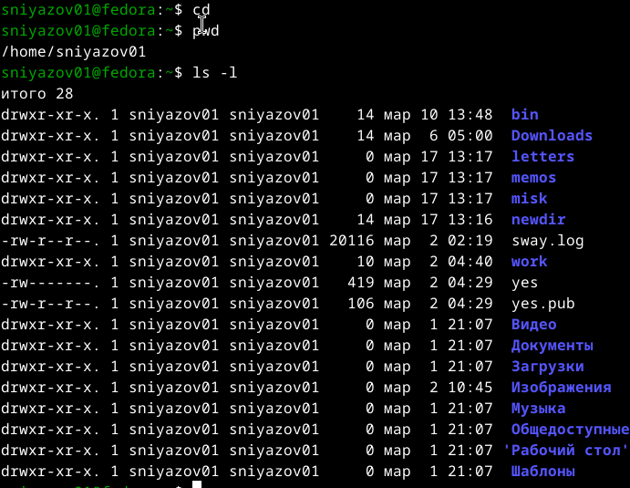
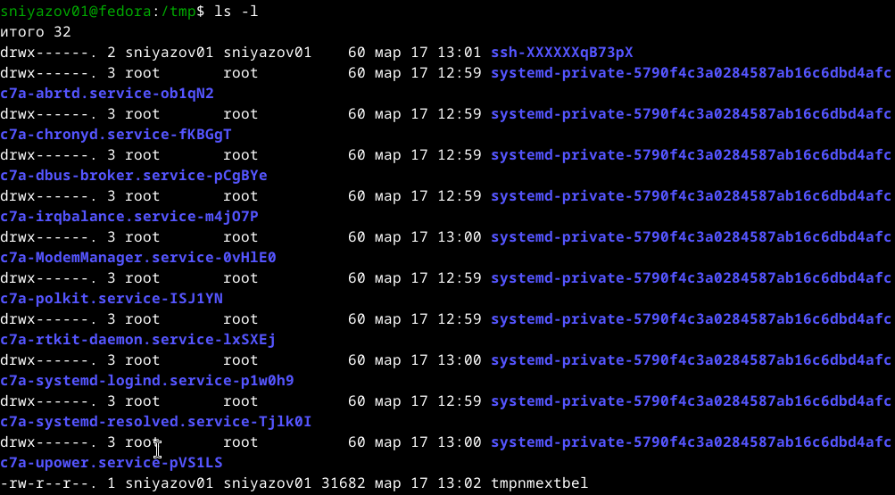
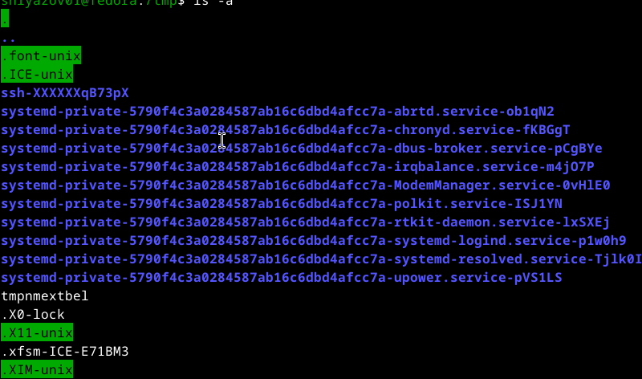
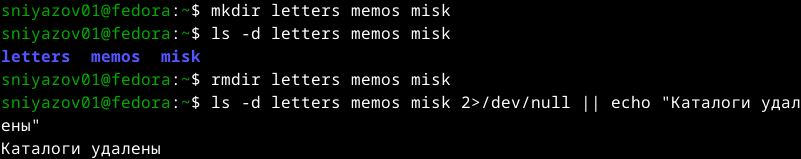
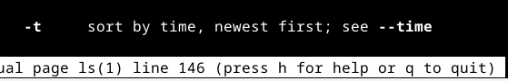
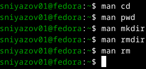
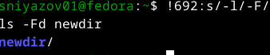

## Цель работы

Приобретение практических навыков взаимодействия с системой Unix через командную строку.

**Задачи:**
- Навигация по файловой системе
- Управление каталогами и файлами
- Получение справочной информации
- Работа с историей команд

---

## 1. Домашний каталог

```bash
$ pwd
/home/sniyazov01
```

{width=70%}

---

## 2. Работа с /tmp

**Переход:** `cd /tmp`

**Просмотр содержимого с разными опциями:**

| Опция | Назначение |
|-------|------------|
| `ls`  | только имена |
| `ls -l` | подробная информация |
| `ls -a` | все файлы (включая скрытые) |
| `ls -F` | индикаторы типа файлов |

---

### Примеры ls в /tmp

<!-- --> | <!-- -->
:---:|:---:
`ls` | `ls -l`

---

<!-- --> | <!-- -->
:---:|:---:
`ls -a` | `ls -F`

---

## 3. Наличие подкаталога cron

```bash
$ ls /var/spool | grep cron
anacron
cron
```

{width=70%}

---

## 4. Создание каталогов

**Создание** `newdir` и вложенного `morefun`:

```bash
mkdir newdir
mkdir newdir/morefun
```

<!-- --> <!-- -->

---

## 5. Создание и удаление трёх каталогов одной командой

```bash
mkdir letters memos musk
rmdir letters memos musk
```



---

## 6. Удаление каталогов

**Попытка удалить** `newdir` командой `rm` (не удаляется):

```bash
$ rm newdir
rm: невозможно удалить 'newdir': Это каталог
```

**Удаление подкаталога** `morefun`:

```bash
rmdir newdir/morefun
```

 

---

## 7. Полезные опции ls (из man)

**Рекурсивный просмотр:** `ls -R`  


**Сортировка по времени:** `ls -lt`  


---

## 8. Изучение команд через man

- `man cd`  
- `man pwd`  
- `man mkdir`  
- `man rmdir`  
- `man rm`



---

## Основные опции изученных команд

| Команда | Опции |
|---------|-------|
| `pwd` | `-L` (логический), `-P` (физический) |
| `mkdir` | `-m` (права), `-p` (родительские), `-v` (подробно) |
| `rmdir` | `-p` (удалить предков), `-v` |
| `rm` | `-f` (без подтверждения), `-i` (с подтверждением), `-r` (рекурсивно) |

---

## 9. Модификация команд из истории

```bash
$ history | tail -5
  692  ls -l
$ !692:s/-l/-F/
ls -F
newdir/
```



---

## Заключение

**Что освоено:**
- Навигация (`cd`, `pwd`)
- Просмотр файлов (`ls` с опциями)
- Создание/удаление каталогов (`mkdir`, `rmdir`, `rm -r`)
- Справочная система `man`
- История команд и её модификация

**Все задачи выполнены, цель достигнута.**

---

## Спасибо за внимание!

