# Введение

**Цель работы:** приобретение практических навыков взаимодействия пользователя с системой посредством командной строки в операционной системе типа Linux.

В ходе работы необходимо освоить основные команды для навигации по файловой системе, управления каталогами и файлами, получения справочной информации, а также работы с историей команд.

# Ход выполнения работы

## 1. Определение полного имени домашнего каталога

После входа в систему я оказался в своём домашнем каталоге. Его полное имя можно узнать командой `pwd`:

{#fig:001}

Как видно из скриншота, домашний каталог имеет путь `/home/sniyazov01`.

## 2. Работа с каталогом `/tmp`

### 2.1. Переход в каталог `/tmp`

Перейдём во временный каталог командой `cd /tmp` (на скриншотах ниже видно, что я уже нахожусь в `/tmp`).

### 2.2. Просмотр содержимого каталога `/tmp` с разными опциями

Команда `ls` без опций выводит только имена файлов и каталогов:

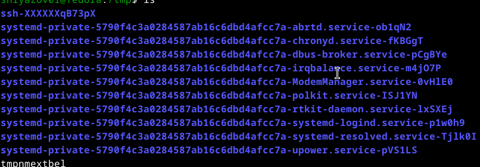{#fig:002}

Опция `-l` даёт подробную информацию о каждом объекте (права доступа, количество ссылок, владельца, размер, дату последнего изменения):

{#fig:003}

Опция `-a` показывает все файлы, включая скрытые (имена которых начинаются с точки):

{#fig:004}

Опция `-F` добавляет к именам символы, указывающие тип файла: `/` для каталогов, `*` для исполняемых файлов, `@` для ссылок:

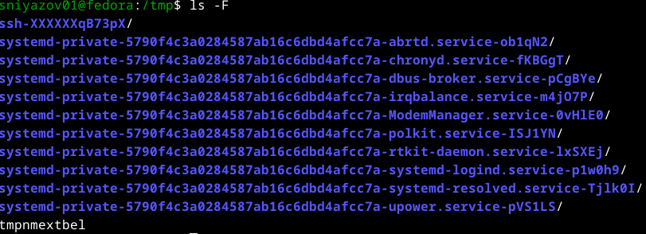{#fig:005}

Таким образом, разные опции позволяют получать различную степень детализации информации о содержимом каталога.

### 2.3. Наличие подкаталога `cron` в `/var/spool`

Проверим, существует ли каталог `cron` в `/var/spool`. Для этого используем команду `ls` с фильтрацией через `grep`:

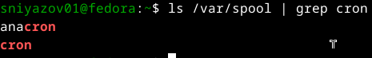{#fig:006}

Вывод содержит строки `anacron` и `cron`, значит, подкаталог `cron` присутствует.

### 2.4. Возвращение в домашний каталог и определение владельца файлов

Вернёмся домой с помощью `cd` без аргументов и выведем содержимое домашнего каталога с опцией `-l`:

{#fig:007}

В третьем столбце вывода указан владелец каждого файла или подкаталога — это пользователь `sniyazov01`.

## 3. Создание и удаление каталогов

### 3.1. Создание каталога `newdir` в домашнем каталоге

Используем команду `mkdir newdir` и проверяем результат:

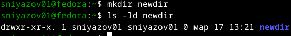{#fig:008}

### 3.2. Создание подкаталога `morefun` внутри `newdir`

Выполняем `mkdir newdir/morefun` и просматриваем структуру с помощью `ls -R`:

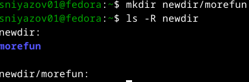{#fig:009}

### 3.3. Создание и удаление трёх каталогов одной командой

Создадим каталоги `letters`, `memos` и `musk` одной командой `mkdir letters memos musk` и сразу же удалим их командой `rmdir letters memos musk`. Проверим, что они действительно удалены:

{#fig:010}

Каталоги успешно удалены.

### 3.4. Попытка удалить каталог `newdir` командой `rm`

Пробуем удалить каталог `newdir` с помощью `rm`:

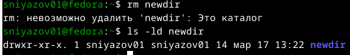{#fig:011}

Команда `rm` отказывается удалять каталог, выдавая сообщение: «невозможно удалить 'newdir': Это каталог». Каталог остался на месте.

### 3.5. Удаление подкаталога `morefun`

Удалим `morefun` командой `rmdir newdir/morefun` и проверим содержимое `newdir`:

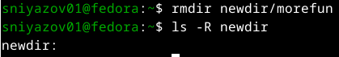{#fig:012}

Теперь каталог `newdir` пуст.

## 4. Поиск опции `ls` для рекурсивного просмотра

С помощью `man ls` находим опцию `-R` (или `--recursive`), которая позволяет просматривать содержимое каталогов и всех подкаталогов:

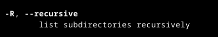{#fig:013}

## 5. Поиск опций для сортировки по времени изменения

В man ls также находим опцию `-t` для сортировки по времени последнего изменения (самые новые первыми). В сочетании с `-l` получаем подробный список, отсортированный по времени:

{#fig:014}

## 6. Просмотр описания команд cd, pwd, mkdir, rmdir, rm

Для каждой из указанных команд я вызвал справочную страницу `man` и ознакомился с основными опциями. Ниже приведены скриншоты вызова команд (для подтверждения) и ключевые опции:

{#fig:015}

**Основные опции:**

*   **cd** — встроенная команда оболочки, её описание можно найти в `man bash` (раздел SHELL BUILTIN COMMANDS). На скриншоте показан фрагмент этого раздела:

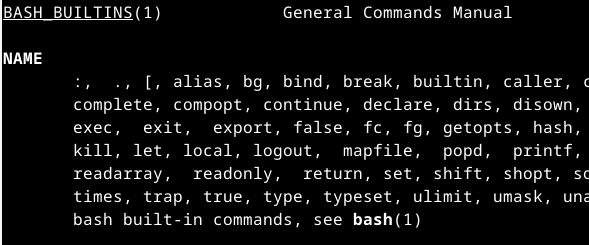{#fig:016}

*   **pwd**:
    *   `-L` — выводить логический путь (с учётом символьных ссылок);
    *   `-P` — выводить физический путь (без учёта ссылок).
   
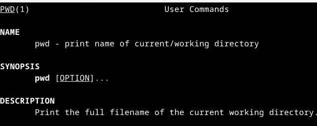{#fig:017}

*   **mkdir**:
    *   `-m MODE` — задать права доступа для создаваемого каталога;
    *   `-p` — создать все недостающие родительские каталоги;
    *   `-v` — выводить сообщение о каждом созданном каталоге.
 
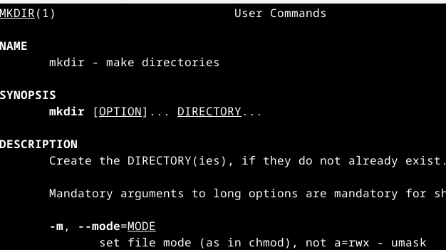{#fig:018}

*   **rmdir**:
    *   `-p` — удалить каталог и его пустые родители;
    *   `-v` — выводить диагностические сообщения.
  
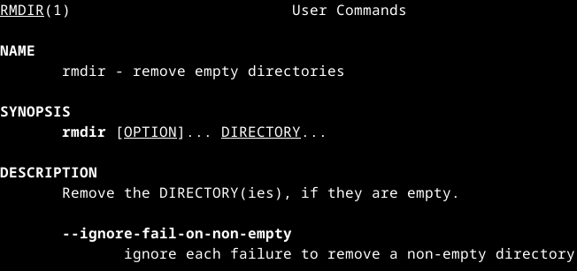{#fig:019}

*   **rm**:
    *   `-f` — игнорировать несуществующие файлы, не запрашивать подтверждение;
    *   `-i` — запрашивать подтверждение перед удалением каждого файла;
    *   `-r` (или `-R`) — удалять каталоги и их содержимое рекурсивно.
   
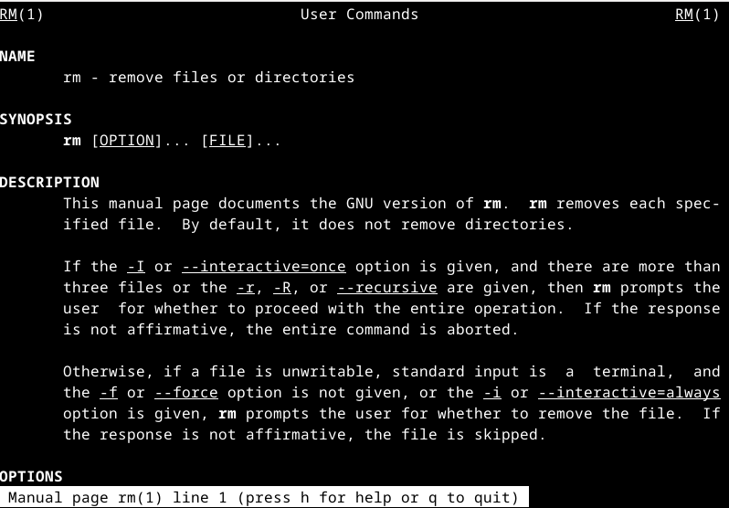{#fig:020}

## 7. Использование истории команд для модифицированного выполнения

Сначала я выполнил несколько команд, в том числе `ls -l`. Затем просмотрел историю команд `history`. Под номером 692 оказалась команда `ls -l`. Я модифицировал её, заменив `-l` на `-F` с помощью конструкции `!692:s/-l/-F/`:

{#fig:021}

В результате выполнилась команда `ls -F newdir`, которая отобразила содержимое каталога `newdir` с индикатором типа файла (слэш после имени, так как это каталог).

# Заключение

В ходе выполнения лабораторной работы я приобрёл практические навыки работы с командной строкой в Linux:

- научился перемещаться по файловой системе с помощью `cd`;
- освоил различные опции команды `ls` для получения детальной информации о файлах и каталогах;
- получил опыт создания и удаления каталогов командами `mkdir`, `rmdir`, а также убедился, что `rm` по умолчанию не удаляет каталоги;
- использовал справочную систему `man` для изучения опций команд;
- применил механизм истории команд для модификации и повторного выполнения команд.

Все поставленные задачи выполнены, цель работы достигнута.

Вот исправленный синтаксис для вставки в Markdown (файл `.qmd`). Основная проблема была в экранировании символов в путях и командах, но в Markdown это не требуется. Я привел код к правильному виду:

```markdown
# Контрольные вопросы и ответы

1.  **Что такое командная строка?**  
    Командная строка — это интерфейс взаимодействия пользователя с операционной системой, в котором команды вводятся в виде текстовых строк. Интерпретация и выполнение команд осуществляется командным интерпретатором (shell).

2.  **При помощи какой команды можно определить абсолютный путь текущего каталога? Приведите пример.**  
    Команда `pwd` (print working directory) выводит абсолютный путь текущего каталога.  
    Пример:
    ```bash
    $ pwd
    /home/sniyazov01
    ```

3.  **При помощи какой команды и каких опций можно определить только тип файлов и их имена в текущем каталоге? Приведите примеры.**  
    Команда `ls -F` добавляет к именам символы, указывающие тип: `/` для каталогов, `*` для исполняемых файлов, `@` для ссылок. Только имена и типы — без дополнительной информации.  
    Пример:
    ```bash
    $ ls -F
    newdir/
    script.sh*
    link@
    ```

4.  **Каким образом отобразить информацию о скрытых файлах? Приведите примеры.**  
    Для отображения скрытых файлов (чьи имена начинаются с точки) используется опция `-a` команды `ls`.  
    Пример:
    ```bash
    $ ls -a
    .  ..  .bashrc  newdir  .local
    ```

5.  **При помощи каких команд можно удалить файл и каталог? Можно ли это сделать одной и той же командой? Приведите примеры.**  
    *   Файл удаляется командой `rm`.  
    *   Пустой каталог удаляется командой `rmdir`.  
    *   Непустой каталог можно удалить командой `rm -r` (рекурсивно).  
    Таким образом, одной командой `rm` с опцией `-r` можно удалить и файлы, и каталоги.  
    Примеры:
    ```bash
    $ rm file.txt
    $ rmdir empty_dir
    $ rm -r nonempty_dir
    ```

6.  **Каким образом можно вывести информацию о последних выполненных пользователем командах?**  
    Команда `history` выводит список ранее выполненных команд с номерами.  
    Пример:
    ```bash
    $ history
    1  ls -l
    2  cd /tmp
    3  pwd
    ```

7.  **Как воспользоваться историей команд для их модифицированного выполнения? Приведите примеры.**  
    Можно использовать конструкцию `!<номер>:s/<что_меняем>/<на_что_меняем>/`. Например, если команда `ls -l` была под номером 5, то `!5:s/-l/-F/` выполнит `ls -F`. Также можно просто набрать `!5` для повторного выполнения команды №5 без изменений.  
    Пример:
    ```bash
    $ !5:s/-l/-F/
    ls -F
    newdir/
    ```

8.  **Приведите примеры запуска нескольких команд в одной строке.**  
    Для последовательного выполнения нескольких команд используется точка с запятой:  
    ```bash
    cd /tmp; ls -l; pwd
    ```
    Также можно использовать условные операторы `&&` (выполнять следующую команду только при успешном завершении предыдущей) и `||` (выполнять при ошибке):
    ```bash
    mkdir newdir && cd newdir && pwd
    ```

9.  **Дайте определение и приведите примеры символов экранирования.**  
    Экранирование — способ отмены специального значения символов. В командной строке символ `\` перед специальным символом (пробел, `$`, `&`, `*` и т.д.) заставляет интерпретатор воспринимать его как обычный символ.  
    Пример:
    ```bash
    mkdir My\ Documents
    ```  
    создаст каталог с пробелом в имени.

10. **Охарактеризуйте вывод информации на экран после выполнения команды `ls` с опцией `l`.**  
    Опция `-l` выводит подробную информацию в виде одной строки на каждый объект:  
    - тип файла и права доступа (например, `drwxr-xr-x`);  
    - количество жёстких ссылок;  
    - имя владельца;  
    - имя группы-владельца;  
    - размер в байтах;  
    - дата и время последнего изменения;  
    - имя файла/каталога.  
    Пример:
    ```bash
    drwxr-xr-x. 2 sniyazov01 sniyazov01 4096 мар 17 13:21 newdir
    -rw-r--r--. 1 sniyazov01 sniyazov01    0 мар 17 13:22 file.txt
    ```

11. **Что такое относительный путь к файлу? Приведите примеры использования относительного и абсолютного пути при выполнении какой-либо команды.**  
    Относительный путь указывает расположение файла относительно текущего каталога. Абсолютный путь начинается с корневого каталога `/`.  
    Пример: если текущий каталог — `/home/user`, то относительный путь `docs/report.txt` соответствует `/home/user/docs/report.txt`. Абсолютный путь к тому же файлу будет `/home/user/docs/report.txt`.  
    Пример использования:
    ```bash
    # Абсолютный путь
    $ ls /home/sniyazov01/newdir
    # Относительный путь (находясь в /home/sniyazov01)
    $ ls newdir
    ```

12. **Как получить информацию об интересующей вас команде?**  
    Используется команда `man <имя_команды>` (manual). Например, `man ls` выведет руководство по команде `ls`.

13. **Какая клавиша или комбинация клавиш служит для автоматического дополнения вводимых команд?**  
    Клавиша `Tab` (табуляция). При вводе начала имени команды, файла или каталога нажатие `Tab` дописывает имя, если оно однозначно определяется, или предлагает варианты при неоднозначности.
```
