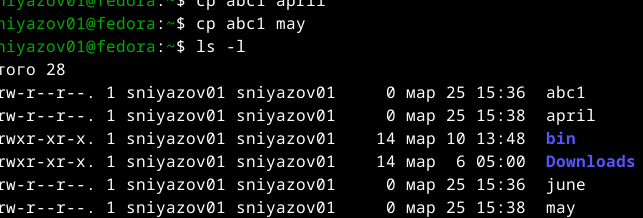

# Цель и задание

**Цель:** ознакомление с файловой системой Linux, приобретение навыков работы с командами для файлов и каталогов.

**Задание:**
- Создание, копирование, перемещение файлов и каталогов
- Изменение прав доступа (`chmod`)
- Анализ файловой системы (`mount`, `df`, `fsck`)
- Ответы на контрольные вопросы

---

# Основные команды для файлов

| Команда | Назначение |
|---------|------------|
| `touch` | создание пустого файла |
| `cp` | копирование файлов/каталогов |
| `mv` | перемещение/переименование |
| `chmod` | изменение прав доступа |
| `mount` | просмотр смонтированных ФС |
| `df -h` | свободное место на дисках |

---

# Копирование и перемещение

**Копирование:**
```bash
cp file1 file2                    # копирование файла
cp -r dir1 dir2                   # рекурсивное копирование каталога
cp file1 file2 dir/               # копирование нескольких файлов в каталог
```

**Перемещение/переименование:**
```bash
mv file1 file2                    # переименование
mv file dir/                      # перемещение в каталог
```



---

# Права доступа

**Права:** `r` (чтение), `w` (запись), `x` (выполнение)

**Структура:** `-rwxr-xr--`
- `-` – тип (файл) / `d` – каталог
- `rwx` – владелец
- `r-x` – группа
- `r--` – остальные

**Изменение прав:**
```bash
chmod u+x file    # добавить выполнение владельцу
chmod g-w file    # убрать запись у группы
chmod 755 file    # rwxr-xr-x
```


---

# Анализ файловой системы

**Просмотр смонтированных ФС:**
```bash
mount | head -10
```

**Свободное место:**
```bash
df -h
```

**Проверка целостности:**
```bash
fsck --help
```


---

# Контрольные вопросы (часть 1)

1. **Создание файла:** `touch` – пустой файл; `echo >` или редактор – с содержимым.

2. **Просмотр файла:** `cat` (целиком), `less` (постранично), `head`/`tail` (первые/последние строки).

3. **Копирование в текущем каталоге:** `cp исходный целевой`

4. **Копирование нескольких файлов в каталог:** `cp файл1 файл2 каталог/`

5. **Копирование каталога:** `cp -r исходный целевой`

---

# Контрольные вопросы (часть 2)

6. **Перемещение файла:** `mv файл каталог/`

7. **Переименование файла:** `mv старое новое`

8. **Команда `mv`:** перемещение и переименование, опция `-i` – подтверждение перезаписи.

9. **Права доступа:** определяют `r`/`w`/`x` для владельца, группы, остальных.  
   Изменяются командой `chmod` (символьно: `u+x`, `g-w`; числово: `755`).

---

# Результаты работы

**Выполненные операции:**
- Создание файлов `abc1`, `april`, `may`, `june`
- Копирование в каталог `monthly`
- Рекурсивное копирование `monthly.00`
- Переименование `april` → `july`
- Перемещение файлов и каталогов
- Изменение прав доступа (`chmod u+x`, `g-w`, `g+w`)
- Анализ ФС (`mount`, `df -h`)

---

# Выводы

В ходе лабораторной работы освоены:

- Основные команды Linux для работы с файлами и каталогами
- Изменение прав доступа символьным и числовым способом
- Анализ файловой системы (смонтированные ФС, свободное место)

Полученные навыки необходимы для администрирования и эффективной работы в среде Linux.

---

# Спасибо за внимание!