# Цель работы

Ознакомление с файловой системой Linux, её структурой, именами и содержимым каталогов. Приобретение практических навыков по применению команд для работы с файлами и каталогами, управлению процессами, проверке использования диска и обслуживанию файловой системы.

# Задание

1. Изучить команды для работы с файлами и каталогами: `touch`, `cat`, `less`, `head`, `tail`, `cp`, `mv`, `chmod`, `mount`, `df`, `fsck`.
2. Выполнить практические примеры:
   - Создание файлов.
   - Копирование файлов и каталогов.
   - Перемещение и переименование файлов и каталогов.
   - Изменение прав доступа к файлам и каталогам.
   - Анализ файловой системы (просмотр смонтированных ФС, файла `/etc/fstab`, свободного места, проверка целостности).
3. Ответить на контрольные вопросы.

# Ход выполнения работы

## Создание файлов и первичные операции

Перешли в домашний каталог:
```bash
cd
```

Создали пустые файлы `abc1`, `april`, `may`, `june`:
```bash
touch abc1 april may june
```

Проверили создание:
```bash
ls -l
```

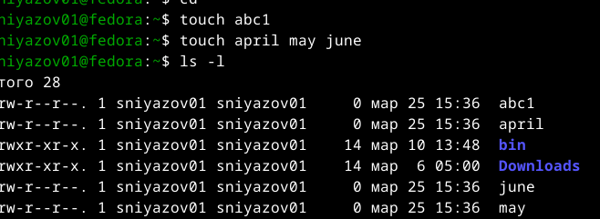

Скопировали файл `abc1` в файлы `april` и `may`:
```bash
cp abc1 april
cp abc1 may
```

Файлы `april` и `may` появились в домашнем каталоге:


## Копирование файлов в каталог

Создали каталог `monthly`:
```bash
mkdir monthly
```

Скопировали файлы `april` и `may` в каталог `monthly`:
```bash
cp april may monthly/
```

Проверили содержимое `monthly`:
```bash
ls -l monthly
```

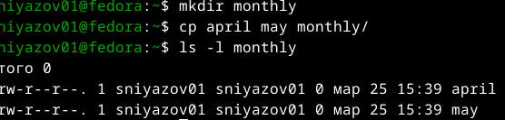

Скопировали файл `may` из каталога `monthly` в тот же каталог с именем `june`:
```bash
cp monthly/may monthly/june
```

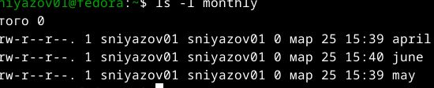

## Рекурсивное копирование каталогов

Создали каталог `monthly.00`:
```bash
mkdir monthly.00
```

Скопировали содержимое `monthly` в `monthly.00` с опцией `-r`:
```bash
cp -r monthly monthly.00/
```

Проверили:
```bash
ls -l monthly.00
```

Внутри появился подкаталог `monthly`:

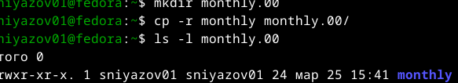

## Переименование и перемещение файлов и каталогов

Переименовали файл `april` в `july`:
```bash
mv april july
```

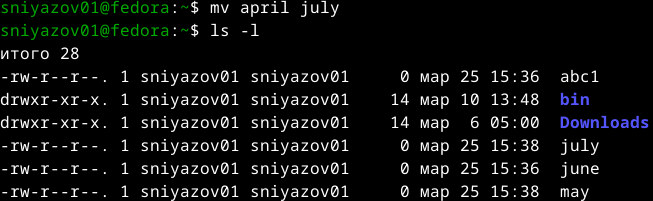

Переместили файл `july` в каталог `monthly.00`:
```bash
mv july monthly.00/
```

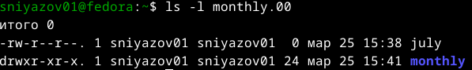

Переименовали каталог `monthly.00` в `monthly.01`:
```bash
mv monthly.00 monthly.01
```

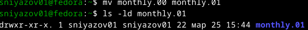

Создали каталог `reports` и переместили `monthly.01` в него:
```bash
mkdir reports
mv monthly.01 reports/
```

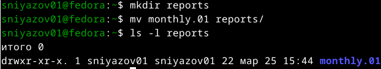

Переименовали `reports/monthly.01` в `reports/monthly`:
```bash
mv reports/monthly.01 reports/monthly
```

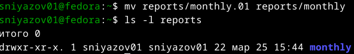

После всех операций содержимое домашнего каталога:
```bash
ls -l
```

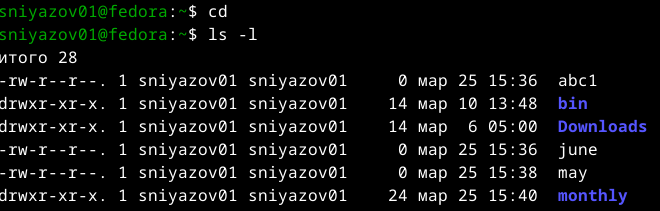

## Изменение прав доступа

Добавили право выполнения для владельца файла `may`:
```bash
chmod u+x may
ls -l may
```

Права стали `-rwxr--r--`:

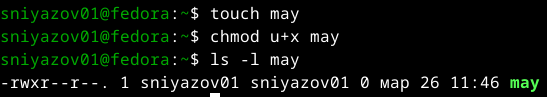

Убрали право выполнения:
```bash
chmod u-x may
ls -l may
```

Права вернулись к `-rw-r--r--`:

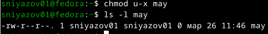

Лишили группу права чтения для каталога `monthly`:
```bash
chmod g-r monthly
ls -ld monthly
```

Права каталога стали `drwx--x--x`:

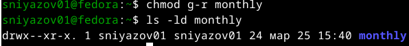

Добавили группе право записи для файла `abc1`:
```bash
chmod g+w abc1
ls -l abc1
```

Права стали `-rw-rw-r--`:

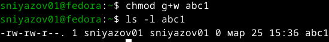

## Анализ файловой системы

Просмотр смонтированных файловых систем (первые 10 строк):
```bash
mount | head -10
```

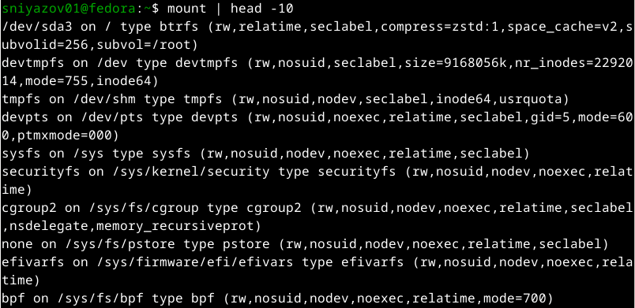

Просмотр файла `/etc/fstab`:
```bash
cat /etc/fstab
```

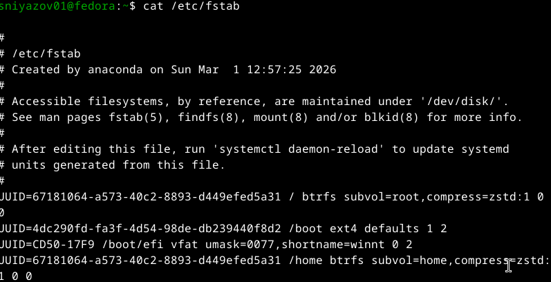

Определение свободного места на дисках:
```bash
df -h
```

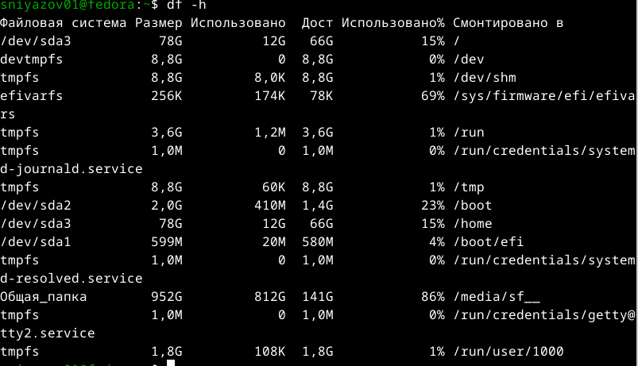

Получение справки по команде `fsck`:
```bash
fsck --help
```

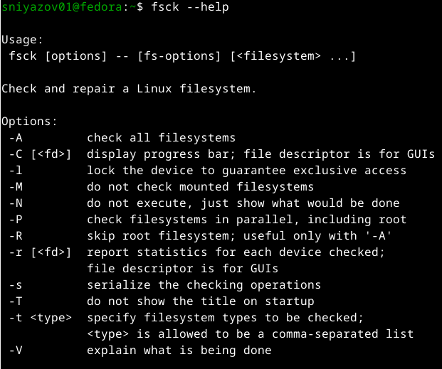

# Ответы на контрольные вопросы

1. **Какие команды используются для создания текстового файла?**  
   Для создания пустого файла используется команда `touch <имя_файла>`. Для создания файла с содержимым можно использовать перенаправление вывода, например `echo "текст" > файл` или редакторы (`nano`, `vim`).

2. **Какие команды используются для просмотра содержимого файла?**  
   - `cat` – выводит содержимое целиком (для небольших файлов).  
   - `less` – постраничный просмотр, позволяет прокручивать (пробел – вперёд, `b` – назад, `q` – выход).  
   - `head` – выводит первые 10 строк (можно указать `-n`).  
   - `tail` – выводит последние 10 строк.

3. **Как скопировать файл в текущем каталоге?**  
   `cp исходный_файл целевой_файл` – создаёт копию с новым именем.

4. **Как скопировать несколько файлов в другой каталог?**  
   `cp файл1 файл2 каталог/` – файлы копируются в указанный каталог.

5. **Как скопировать каталог с его содержимым?**  
   Используется команда `cp -r исходный_каталог целевой_каталог` (рекурсивное копирование).

6. **Как переместить файл в другой каталог?**  
   `mv файл каталог/` – перемещает файл в указанный каталог.

7. **Как переименовать файл?**  
   `mv старое_имя новое_имя` – переименование в пределах одного каталога.

8. **Основные возможности команды `mv` в Linux.**  
   `mv` используется для перемещения файлов и каталогов, а также для их переименования. При перемещении между разделами происходит копирование с последующим удалением оригинала. Опция `-i` запрашивает подтверждение перед перезаписью.

9. **Что такое права доступа? Как они могут быть изменены?**  
   Права доступа определяют, какие действия (чтение `r`, запись `w`, выполнение `x`) разрешены владельцу, группе и остальным пользователям.  
   Для изменения прав используется команда `chmod`. Она может принимать символьную запись (`u+rwx`, `g-w`, `o=r` и т.п.) или восьмеричные коды (например, `755` – `rwxr-xr-x`).  
   Также можно использовать `chown` для смены владельца, `chgrp` для смены группы.

# Выводы

В ходе лабораторной работы были освоены основные команды Linux для работы с файловой системой:
- Создание, копирование, перемещение и переименование файлов и каталогов.
- Изменение прав доступа символьным способом.
- Просмотр информации о смонтированных файловых системах, использовании дискового пространства и целостности ФС.

Полученные навыки необходимы для эффективного администрирования и работы в среде Linux.

# Приложение

Все скриншоты, подтверждающие выполнение команд, приведены в тексте отчёта.  
Листинги команд и их вывод сохранены в виде изображений (image/`1.png` – `19.png`).