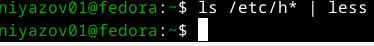
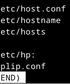
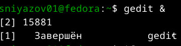
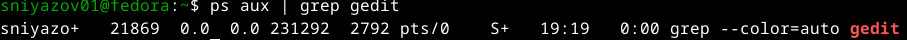
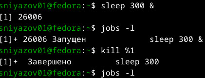
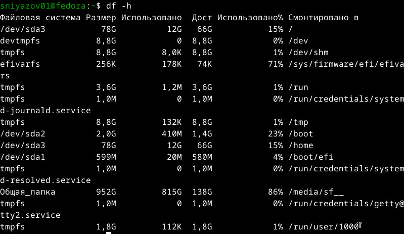

```qmd
---
title: "Лабораторная работа №6 (8): Поиск файлов, перенаправление ввода-вывода, управление процессами"
author: "Ниязов Санджар"
date: "2026-04-01"
format: revealjs
---

# Цель работы

- Ознакомление с инструментами поиска файлов и фильтрации текстовых данных.
- Приобретение практических навыков:
  - управление процессами и заданиями;
  - проверка использования диска;
  - обслуживание файловых систем.

---

# 2. Запись списка файлов

```bash
ls /etc > file.txt
ls ~ >> file.txt
```


---

# 3. Фильтрация файлов `.conf`

```bash
grep "\.conf$" file.txt | tee conf.txt
```


---

# 4. Поиск файлов на букву `c`

```bash
ls -la ~ | grep "^\.* c"
find ~ -maxdepth 1 -type f -name "c*"
find ~ -maxdepth 1 -type f -name "c*" -printf "%f\n"
```


---

# 5. Постраничный вывод из `/etc/h*`

```bash
ls /etc/h* | less
```

  


---

# 6. Фоновый поиск файлов `log*`

```bash
find / -name "log*" -type f > ~/logfile 2>/dev/null &
```


---

# 7. Удаление `~/logfile`

```bash
rm ~/logfile
```


---

# 8. Запуск `gedit` в фоновом режиме

```bash
gedit &
```



---

# 9. Определение PID процесса

```bash
ps aux | grep gedit
```



**Другие способы:** `pgrep gedit`, `pidof gedit`, `jobs -l`

---

# 10. Изучение `man kill` и завершение процесса

```bash
man kill
sleep 300 &
jobs -l
kill %1
jobs -l
```

  


---

# 11. Анализ дискового пространства

**`df -h`**  
```bash
df -h
```


**`du -sh ~`**  
```bash
du -sh ~
```


**`du -h --max-depth=1 ~ | sort -hr`**  
```bash
du -h --max-depth=1 ~ | sort -hr
```


---

# 12. Все директории в домашнем каталоге

```bash
find ~ -type d
```

Фрагмент вывода:
```
/home/sniyazov01
/home/sniyazov01/.cache
/home/sniyazov01/.config
...
```

---

# Основные итоги

- Перенаправление потоков (`>`, `>>`).
- Конвейеры (`|`) и фильтрация (`grep`).
- Управление процессами (`&`, `jobs`, `kill`).
- Контроль диска (`df`, `du`).
- Поиск файлов и каталогов (`find`).

---

# Спасибо за внимание!
```