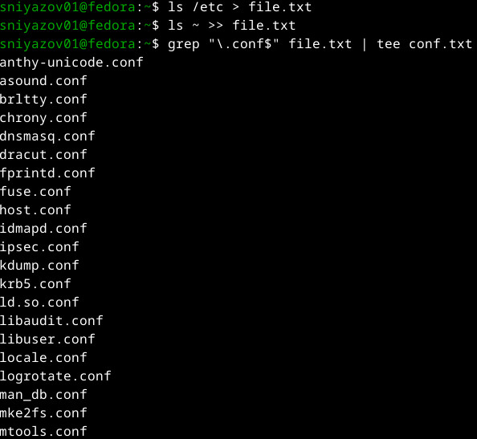
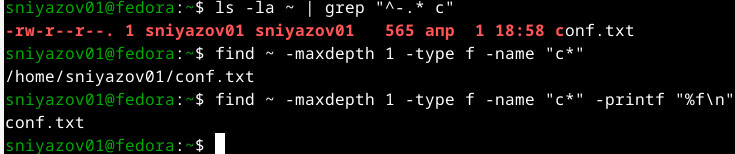
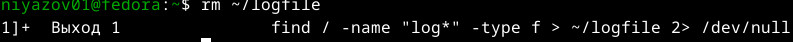
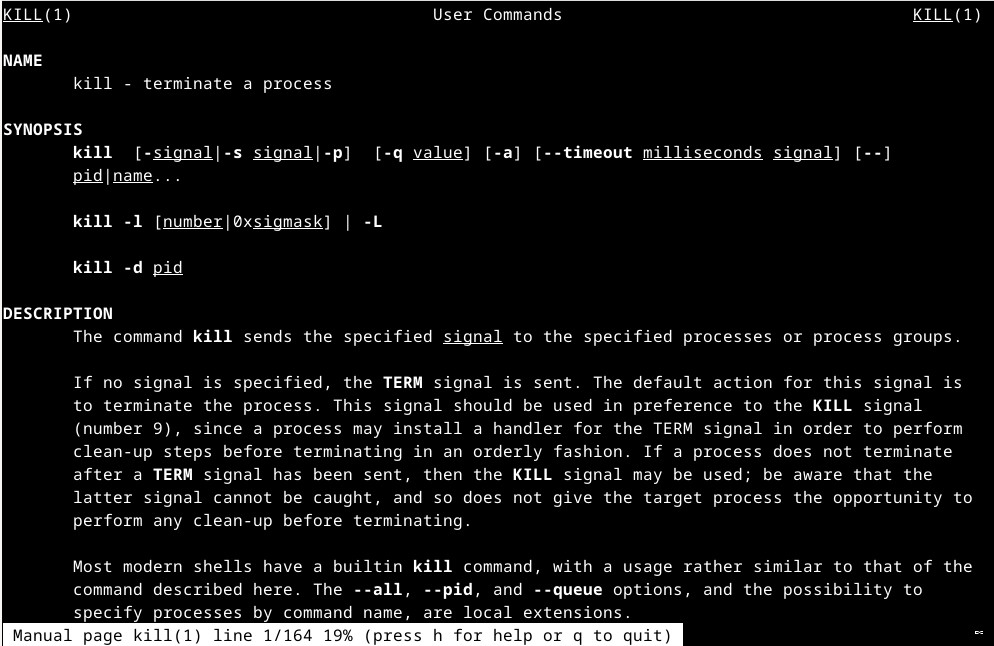
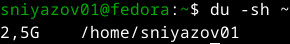
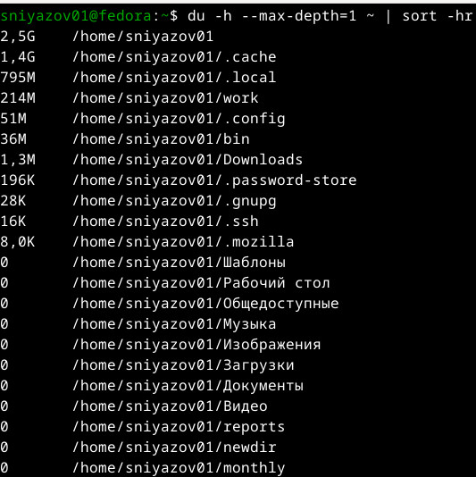

# Цель работы

Ознакомление с инструментами поиска файлов и фильтрации текстовых данных. Приобретение практических навыков: по управлению процессами (и заданиями), по проверке использования диска и обслуживанию файловых систем.

# Задание

1. Записать в файл `file.txt` названия файлов, содержащихся в каталоге `/etc`. Дописать в этот же файл названия файлов, содержащихся в домашнем каталоге.
2. Вывести имена всех файлов из `file.txt`, имеющих расширение `.conf`, после чего записать их в новый текстовой файл `conf.txt`.
3. Определить, какие файлы в домашнем каталоге имеют имена, начинающиеся с символа `c`. Предложить несколько вариантов.
4. Вывести на экран (постранично) имена файлов из каталога `/etc`, начинающихся с символа `h`.
5. Запустить в фоновом режиме процесс, который будет записывать в файл `~/logfile` имена файлов, имена которых начинаются с `log`.
6. Удалить файл `~/logfile`.
7. Запустить из консоли в фоновом режиме редактор `gedit`.
8. Определить идентификатор процесса `gedit`, используя команду, конвейер и фильтр `grep`. Предложить другие способы.
9. Изучить справку (`man`) команды `kill`, после чего использовать её для завершения процесса `gedit`.
10. Выполнить команды `df` и `du`, предварительно получив более подробную информацию о них с помощью `man`.
11. Используя справку команды `find`, вывести имена всех директорий, имеющихся в домашнем каталоге.

# Ход выполнения работы

## 2. Запись в файл `file.txt` списка файлов `/etc` и домашнего каталога

Выполнены команды:

```bash
ls /etc > file.txt      # запись содержимого /etc в file.txt
ls ~ >> file.txt        # добавление содержимого домашнего каталога


## 3. Вывод имён файлов с расширением `.conf` и сохранение в `conf.txt`

С помощью `grep` отфильтрованы строки, оканчивающиеся на `.conf`. Конвейер с `tee` одновременно выводит результат на экран и сохраняет в файл:

```bash
grep "\.conf$" file.txt | tee conf.txt
```


## 4. Поиск файлов в домашнем каталоге, имена которых начинаются на букву `c`

Использованы три различных подхода:

```bash
ls -la ~ | grep "^\.* c"                           # через ls и grep
find ~ -maxdepth 1 -type f -name "c*"             # через find с полным путём
find ~ -maxdepth 1 -type f -name "c*" -printf "%f\n"   # только имена
```

Найден файл `conf.txt`.



## 5. Вывод на экран (постранично) имён файлов из `/etc`, начинающихся с `h`

Команда `ls /etc/h*` выдаёт список, который передаётся в `less` для постраничного просмотра:

```bash
ls /etc/h* | less
```

На скриншотах показан вывод: `host.conf`, `hostname`, `hosts`, а также содержимое каталога `/etc/hp`.

  


## 6. Запуск в фоновом режиме процесса, записывающего в `~/logfile` имена файлов, начинающихся с `log`

```bash
find / -name "log*" -type f > ~/logfile 2>/dev/null &
```

Процесс запущен с идентификатором 10819.


## 7. Удаление файла `~/logfile`

```bash
rm ~/logfile
```

Фоновый процесс завершился с кодом 1 (поскольку файл назначения был удалён).



## 8. Запуск редактора `gedit` в фоновом режиме

```bash
gedit &
```


## 9. Определение идентификатора процесса `gedit`

Для определения PID использована команда `ps aux | grep gedit`:

```bash
ps aux | grep gedit
```

На момент выполнения процесса gedit уже не было, поэтому найден только сам `grep`. В качестве демонстрации навыка управления процессами был запущен тестовый процесс `sleep` (см. пункт 10).


## 10. Изучение `man kill` и завершение процесса

Изучена справочная страница команды `kill`:

```bash
man kill
```



Для демонстрации завершения процесса был запущен `sleep` в фоне, затем он был завершён с помощью `kill`:

```bash
sleep 300 &
jobs -l          # показать PID
kill %1          # завершить по номеру задачи
jobs -l          # проверить, что задача завершена
```


## 11. Выполнение команд `df` и `du`

**`df -h`** – показывает использование дисковых разделов в человекочитаемом виде:

```bash
df -h
```


**`du -sh ~`** – суммарный размер домашнего каталога:

```bash
du -sh ~
```



**`du -h --max-depth=1 ~ | sort -hr`** – размеры подкаталогов с сортировкой по убыванию:

```bash
du -h --max-depth=1 ~ | sort -hr
```



## 12. Вывод всех директорий в домашнем каталоге

С помощью `find` выведены все каталоги внутри `~`:

```bash
find ~ -type d
```

*Фрагмент вывода:*
```
/home/sniyazov01
/home/sniyazov01/.cache
/home/sniyazov01/.config
/home/sniyazov01/.local
/home/sniyazov01/.ssh
/home/sniyazov01/.gnupg
/home/sniyazov01/Документы
/home/sniyazov01/Загрузки
...
```

Полный вывод не приводится из-за большого объёма.

# Ответы на контрольные вопросы

1. **Какие потоки ввода-вывода вы знаете?**  
   `stdin` (0) – стандартный ввод, `stdout` (1) – стандартный вывод, `stderr` (2) – стандартный вывод ошибок.

2. **Объясните разницу между операциями `>` и `>>`.**  
   `>` перенаправляет вывод в файл, перезаписывая его содержимое. `>>` добавляет вывод в конец файла, не удаляя существующие данные.

3. **Что такое конвейер?**  
   Конвейер (`|`) передаёт стандартный вывод одной команды на стандартный ввод другой, позволяя строить цепочки обработки данных.

4. **Что такое процесс? Чем это понятие отличается от программы?**  
   Процесс – это программа в момент выполнения, обладающая собственным адресным пространством, состоянием и ресурсами. Программа – пассивный набор инструкций, хранящийся на диске.

5. **Что такое PID и GID?**  
   PID (Process ID) – уникальный идентификатор процесса. GID (Group ID) – идентификатор группы, к которой принадлежит процесс (или группы пользователя).

6. **Что такое задачи и какая команда позволяет ими управлять?**  
   Задачи (jobs) – процессы, запущенные из текущей оболочки и приостановленные или работающие в фоне. Управление осуществляется командами `jobs`, `fg`, `bg`, `kill`.

7. **Найдите информацию об утилитах top и htop. Каковы их функции?**  
   `top` – интерактивный просмотр процессов и загрузки системы. `htop` – улучшенная версия с цветным интерфейсом, возможностью управления процессами мышью.

8. **Назовите и дайте характеристику команде поиска файлов. Приведите примеры использования.**  
   `find` – рекурсивный поиск объектов файловой системы по имени, типу, размеру, времени и другим критериям.  
   Примеры:  
   - `find ~ -name "*.txt"` – найти все `.txt` в домашнем каталоге.  
   - `find /var -type d -name "log*"` – найти каталоги, начинающиеся на `log`.  
   - `find . -size +10M` – найти файлы размером более 10 МБ.

9. **Можно ли по контексту (содержанию) найти файл? Если да, то как?**  
   Да, можно с помощью `grep -r "искомый текст" /путь` или комбинации `find` и `grep`:  
   `find ~ -type f -exec grep -l "текст" {} \;`

10. **Как определить объём свободной памяти на жёстком диске?**  
    Команда `df -h` показывает использование каждого смонтированного раздела, включая свободное место.

11. **Как определить объём вашего домашнего каталога?**  
    Команда `du -sh ~` выдаёт суммарный размер домашнего каталога.

12. **Как удалить зависший процесс?**  
    Найти его PID (`ps aux | grep имя_процесса`) и отправить сигнал `KILL`: `kill -9 PID`. Также можно использовать `pkill -9 имя_процесса`.

# Выводы

В ходе выполнения лабораторной работы были освоены:
- перенаправление стандартных потоков ввода-вывода (`>`, `>>`);
- использование конвейеров (`|`) для объединения команд;
- поиск файлов с помощью `find` и фильтрация текста с `grep`;
- управление процессами: запуск в фоновом режиме (`&`), просмотр задач (`jobs`), завершение процессов (`kill`);
- анализ использования дискового пространства командами `df` и `du`.

Полученные навыки позволяют эффективно работать в командной оболочке Linux, автоматизировать рутинные операции и контролировать системные ресурсы.
```